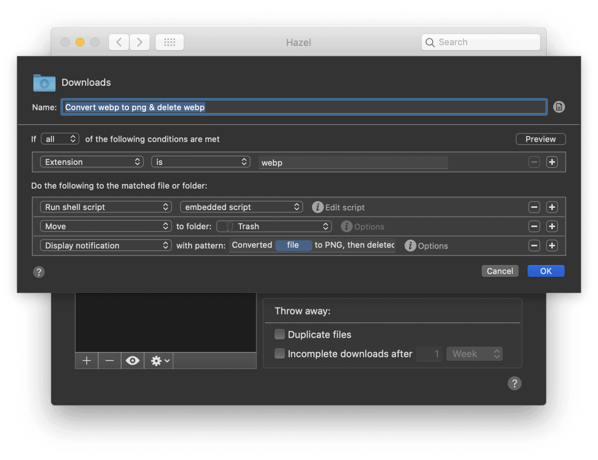
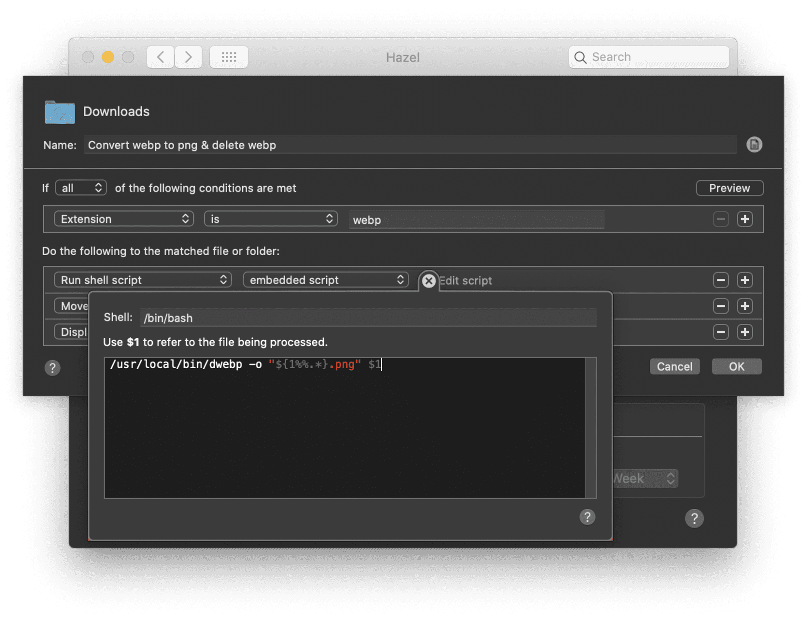

I love [CloudFlare](https://www.cloudflare.com/). It makes websites lots faster. One of the things it does is change PNG files to WebP automatically when your browser (f.i. Google Chrome) supports it. This is awesome, as they’re smaller and it thus loads faster.

However, sometimes I need to download an image file and I end up with a `.webp` file. My operating system can’t handle those. So I have two options: opening the image URL in Safari (which doesn’t support WebP yet) or to convert them to PNG.

I had this happen to me enough that I decided to find a better solution. I run a utility on my Mac called [Hazel, by Noodlesoft](https://www.noodlesoft.com/). This utility helps me keep my Downloads and Trash folders clean, among other things, with rules I can define myself. I decided to add a new rule.

## Prerequisites

To convert `.webp` files to `.png` files, you need [Google’s WebP libraries](https://developers.google.com/speed/webp/download). On your Mac, the easiest way to do that is with [Brew](https://brew.sh/):

```shell
brew install webp
```

### Converting from WebP to PNG

The command to convert a WebP file to PNG would look like this:

```shell
/usr/local/bin/dwebp -o target.png input.webp
```

## Adding the rule to Hazel

Now it’s time to open Hazel and add a rule:

Our rule is going to:

- Find files in the Downloads folder that end in `.webp`.
- Run a script to convert those `.webp` files to PNG.
- Move the `.webp` file to the trash.
- Display a notification to show that it’s done all this.

All this is pretty easy to configure in Hazel. What you’ll need is the following embedded script:

The script is `/bin/bash` as we need to strip the `.webp` extension with some bash magic, and replace it with `.png`:

```shell
/usr/local/bin/dwebp -o "${1%%.*}.png" $1
```

After setting up all the rules as explained above and copy pasting the script, just save the rule. You can save any WebP file to the Downloads folder (or whichever folder you decide to run this rule for) and it should be automatically converted to PNG!
