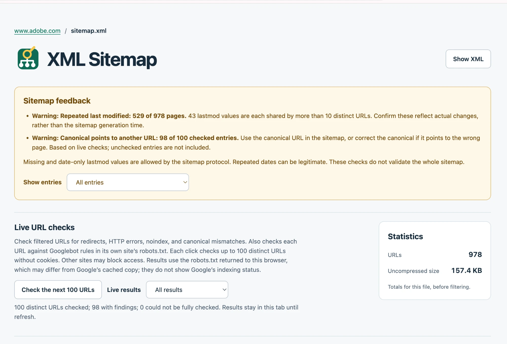
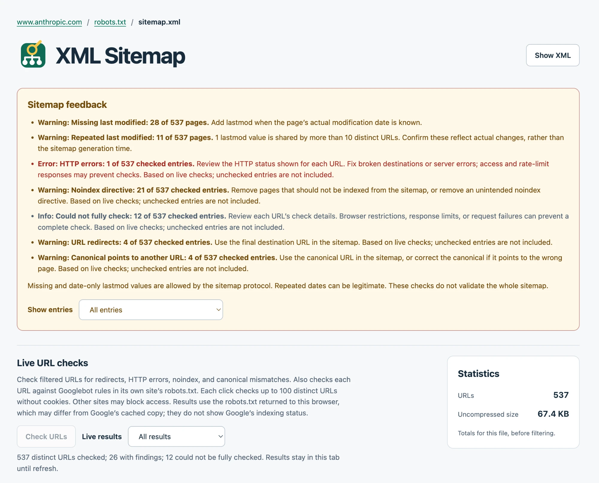
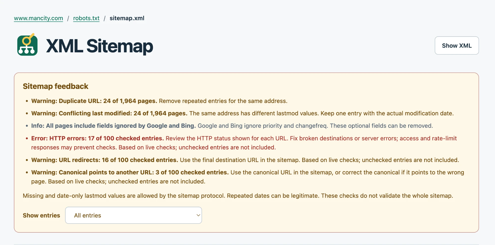
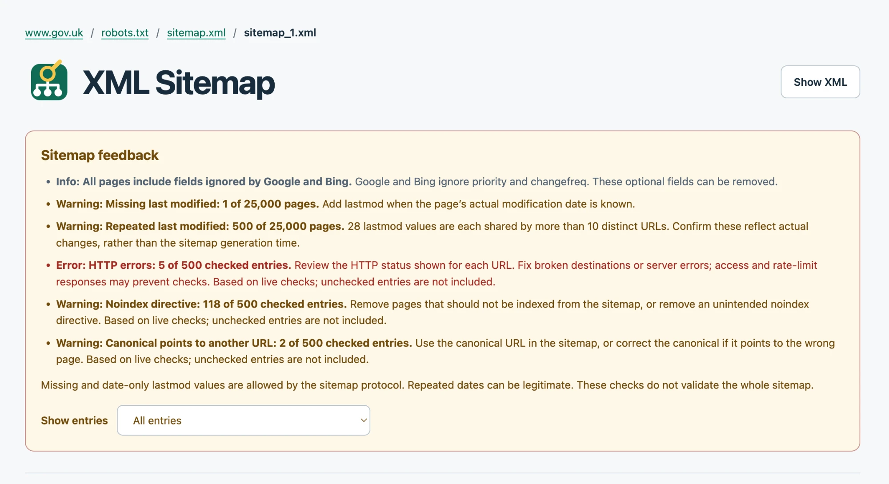
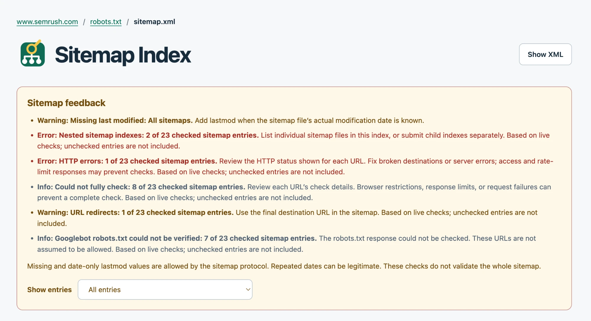

A few weeks ago I wrote about [browsers removing XSLT](/xml-sitemaps-without-xslt/), the feature that makes XML sitemaps look pretty. I built a small Chrome extension to keep them readable. Then I started adding checks. The extension is now called [Sitemap Inspector](/code/sitemap-inspector/), and it has taught me something I did not expect: almost nobody gets XML sitemaps right.

## From pretty view to bug finder

The first version only showed sitemaps as a table you could search and sort. But once you look at sitemaps in a table, the problems jump out. Dates that are all the same. URLs that are clearly wrong. So I added feedback on the file itself, and then optional live checks that fetch the listed URLs and look for redirects, HTTP errors, noindex directives, canonicals that point elsewhere, and Googlebot rules in robots.txt.

Then I pointed it at sites I expected to get this right.

## What "right" means

A sitemap has one job. Google's documentation says it plainly: [include the URLs you want to see in search results](https://developers.google.com/search/docs/crawling-indexing/sitemaps/build-sitemap). Those should be canonical URLs that load. Google will also "attempt to crawl your URLs exactly as listed," so every wrong entry costs a crawl.

That gives two tiers of problems. Some things are allowed but not ideal: missing `lastmod` values, dates without a time, or many pages sharing one date. Repeated dates can be legitimate, and the extension says so. Other things are simply wrong: URLs that redirect, return errors, carry a noindex, or declare another page as canonical. Each of those sends search engines a URL and then tells them not to use it.

The examples below are all from the second tier, or worse. I checked them on 27 September 2026.

## Adobe: canonicals pointing at a template

Adobe's [UK Learn sitemap](https://www.adobe.com/uk/learn/sitemap.xml) lists 978 pages. Of the first 100 I checked, 98 had a canonical pointing to another URL. Not a different language or a trailing slash. Pages like `/uk/learn/indesign/web/add-pages` declare `/uk/learn/indesign/web/__template__` as their canonical. That looks like a placeholder that never got replaced.

The sitemap also has 43 `lastmod` values each shared by more than 10 URLs, and the most common ones fall within two minutes of each other on a single August evening. That could be a real content update. It looks more like a batch job. But the canonical problem is the one that matters: the sitemap says "index this" and the page says "no, index the template."

## Anthropic: noindexed pages listed for indexing

[Anthropic's sitemap](https://www.anthropic.com/sitemap.xml) has 537 URLs. The live checks found 21 with a noindex directive, one 404, and four redirects. The noindexed pages are its legal pages: terms, privacy policies, the acceptable use policy. Keeping those out of search might be a choice. Listing them in the sitemap at the same time sends the opposite signal.

## Man City: former players and duplicates

[Manchester City's sitemap](https://www.mancity.com/sitemap.xml) lists 1,964 pages. Twelve addresses appear twice, each time with a different `lastmod`, so a crawler gets two answers to one question. Of the first 100 URLs I checked, 17 returned an HTTP error and 16 redirected.

The pattern is easy to spot once you look at the URLs. Most of them are player pages for people who have left the club. Riyad Mahrez and Cole Palmer redirect to the men's squad page. Oleksandr Zinchenko and Liam Delap return a 404. The sitemap still lists them as pages worth indexing.

## GOV.UK: deliberate noindex, accidental sitemap

GOV.UK's [first sitemap file](https://www.gov.uk/sitemaps/sitemap_1.xml) has 25,000 URLs. The protocol limit is 50,000, so that part is fine. Of the first 500 I checked, 118 had a noindex directive. Almost all of them are employment and residential property tribunal decisions. Those name private individuals, so keeping them out of search results is very likely deliberate. The mistake is not the noindex. It is putting those pages in the sitemap.

Every entry also carries `priority` and `changefreq`. Google [ignores both](https://developers.google.com/search/docs/crawling-indexing/sitemaps/build-sitemap). That is harmless, just extra bytes.

## X: a sitemap that isn't there

The simplest failure is a sitemap that doesn't exist. [X's robots.txt](https://x.com/robots.txt) points search engines to `https://x.com/sitemap.xml`, and even carries a comment explaining how the URLs in that sitemap should be formatted. That address returns no sitemap at all. There is nothing to format.

## Semrush: an SEO tool with a nested index

Then there's [Semrush's sitemap index](https://www.semrush.com/sitemap.xml). It lists 23 sitemaps and has no `lastmod` on any of them. Its news sitemap returns a 404. Another one 301-redirects to a product page. And two of its entries are sitemap indexes themselves. Google's Search Console documentation is clear on that one: [a sitemap index file can't list other sitemap index files](https://support.google.com/webmasters/answer/7451001), only sitemaps.

Semrush sells tools that audit exactly this.

## Why this keeps happening

None of these are hard problems. A sitemap should list the URLs a site wants indexed, and nothing else. My guess is that the sitemap usually comes from one system, while redirects, canonicals and noindex live in another, and nobody checks whether the two agree. The file validates, so nobody opens it again.

The counterexample supports that guess. Every sitemap I've checked that was generated by Yoast SEO, the plugin I built, comes back clean. That's not luck: the plugin that builds the sitemap also sets the canonicals and the noindex directives, so it leaves out anything it has told search engines not to index.

Some of this is also invisible without tooling. You won't spot a template canonical by reading XML. That's why I kept adding checks to the extension. If you run a site, open your own sitemap in [Sitemap Inspector](https://chromewebstore.google.com/detail/sitemap-inspector/nbapilepkbcgjhmfnincjlkkdnpbibba), click **Check URLs**, and see what comes back. Unless one system owns all of those signals, I would be surprised if it came back clean.
