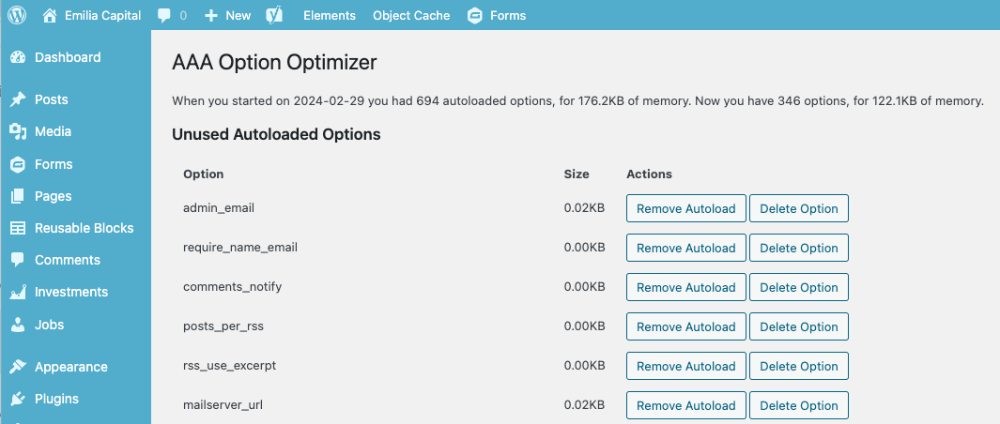

Note: this plugin has received a ton of updates since its inception. It’s now been moved to Progress Planner, where the team there (including myself) are developing it further. So please check out [AAA Option Optimizer on Progress Planner’s website](https://progressplanner.com/plugins/aaa-option-optimizer/).

If you run a WordPress site for a while, it’ll become cluttered. You’ve installed and uninstalled dozens of plugins over the course of your site being alive, and many of those plugins have left their footprint (their options) in your database. I’ve come up with a solution for this, which is the first step of something that I think can be even nicer.

## Why is this a problem?

This wouldn’t be so bad if WordPress didn’t load all the options that are set to “autoload=yes” into its memory in one big load action. Since stray options stay behind in the database when you uninstall a plugin, those options are still loaded into the memory on every pageview. Every. Single. Time.

## How can we solve this?

To solve this, we have to follow a few steps:

1. Determine how bad the problem is by seeing how many autoloaded options we have and how much memory is being used by those options right now.
2. For a while, keep track of all the autoloaded options and whether they are being used. Simply put: every time an autoloaded option is used during page load, we store it. Then we compare the list of options that have been used with those that have been autoloaded. The difference between the two are all the options that are autoloaded but never used.
3. Now we have a list that we can go through and decide to either delete the option entirely or, if you’re unsure, simply remove the autoload=yes from it. If you do the latter, everything keeps on working; the option just isn’t loaded on every page load.

You’re now asking yourself: that sounds quite simple, but… How do I do that?? Well. I’ve built a plugin for it 🙂

## Meet AAA Option Optimizer

This plugin is called [**AAA Option Optimizer**](https://progressplanner.com/plugins/aaa-option-optimizer/). What’s with the funny name? Well, WordPress loads plugins alphabetically. To best measure which options are being loaded, it’s best for the plugin to be loaded *early*. So… I called it AAA Option Optimizer!

When you install the plugin, it measures the current standings immediately and stores them. No need for you to worry about that. Then you should go and click around your site. Be sure to hit every page, both in the front end and in the admin. You could use something like [Screaming Frog](https://www.screamingfrog.co.uk/seo-spider/) on the front end.

Then you go to the plugin’s page. It’s under Tools. It’ll look something like this:

On this page, you remove the options that you no longer need, and you can optimize away. Be sure to make a backup before you do this, because you might of course break things. This is a power tool, don’t give it to people who don’t know what to do with it.

## Future versions: auto optimization?

I actually think this could be turned into something that auto-optimizes. Removes autoload from options automatically when they’re never used, add autoload *to* options that get called a lot but aren’t auto-loaded.

I’d love to hear your thoughts!

**Update 15th April 2024: [the plugin made it to WordPress.org today](https://wordpress.org/plugins/aaa-option-optimizer/)!**
