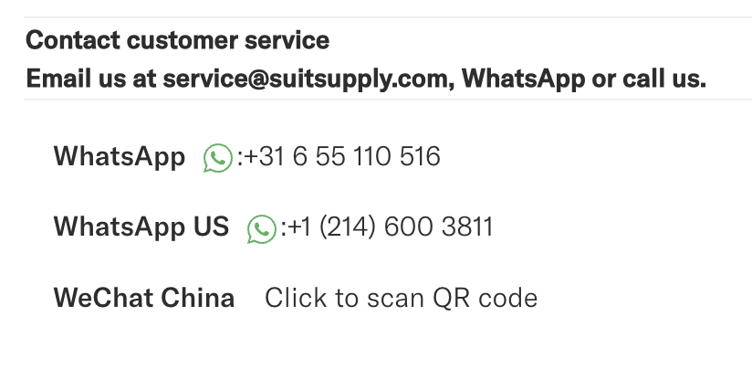
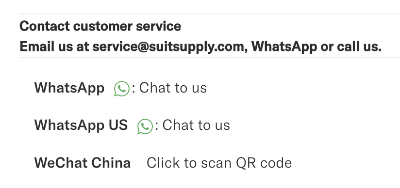

The simple things make life easy. One of them is WhatsApp. And more specifically: customer service through WhatsApp. I love it when companies offer WhatsApp support. What I love a little bit less is when they offer it, but they make me jump through hoops to get to it. I recently ordered some shirts from SuitSupply and ended up needing their support. This is what I ran into:

The email address wasn’t linked and thus not clickable, nor were the WhatsApp numbers. Talking about making me work for it… Now, I don’t even need to *know* your WhatsApp number. I just need you to give me a link that works. And this stuff ain’t hard, so here comes the explanation:

## How to create Clickable WhatsApp links

WhatsApp makes linking to a chat on WhatsApp super simple by allowing you to link to their `wa.me` short domain. So, instead of showing that number in full, making it all look super complicated, just do the following:

```xml
<a href="https://wa.me/31655110516">Talk to us on WhatsApp</a>
```

Leave out all the spaces, dashes, and pluses. You can even add a text to start with:

```xml
<a href="https://wa.me/31655110516?text=I%20need%20help%20with">Talk to us on WhatsApp</a>
```

On [their official support page](https://faq.whatsapp.com/5913398998672934), WhatsApp also provide official “chat on WhatsApp” buttons, but I’d probably just use a text link myself. That’s it! Easy does it.

And then it could look something like this:



Now, of course, they really should underline their links too, but that’s another matter.

## Post Scriptum: other links

So, you really also should link all email addresses with `mailto:` links and phone numbers with `tel:` links, so I can click them and start writing that email or start calling you:

```xml
<a href="tel:0031655110516">Call us</a>
```

or:

```xml
<a href="mailto:service@suitsupply.com">Mail us</a>
```

It’s not just WhatsApp links, everything that you expect me to do on a phone, you should be making it easier for me, and adding links like this is super simple.
