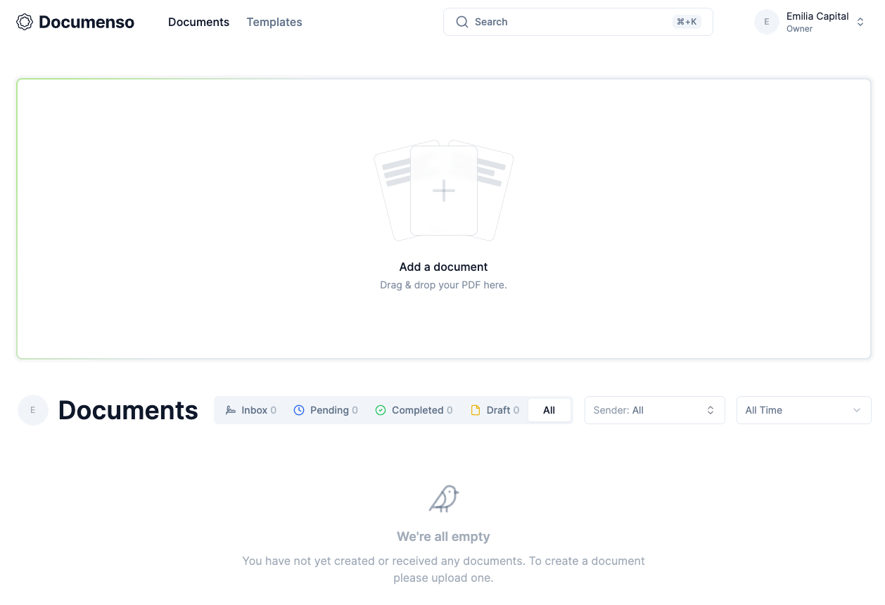

## Migrating from SaaS to open-source

In my quest to move most of my SaaS services to self-hosted open-source software, I’ve taken on the next step: our document signing infrastructure. Everyone seems to be using Docusign, but as with all SaaS tools, that can get really expensive. While we don’t do a ton of contracts at Emilia Capital, I did already spend $25 / month, just to get some PDFs signed. [Documenso](https://documenso.com/) is a great solution!

Documenso has basically all the features Docusign has with one exception so far: I’ve not been able to get it to do initials yet, which might get annoying for some document types. But otherwise it already looks pretty feature complete to me for a document signing solution.

## Table of contents

- [Migrating from SaaS to open-source](#h-migrating-from-saas-to-open-source)
- [The software](#h-the-software)
- [The benefits](#h-the-benefits)
- [The economics](#the-economics)
    - [The cost of Docusign](#h-the-cost-of-docusign)
    - [The cost of Documenso](#h-the-cost-of-documenso)
- [Conclusion](#h-conclusion)

## The software

Installing Documenso is relatively trivial if you know how reverse proxies work, but let’s walk through the steps;

1. You follow the install steps for [self-hosting in their readme](https://github.com/documenso/documenso/?tab=readme-ov-file#self-hosting); it requires `npm` and a bunch of other libraries on your system and you need to have a Postgres database running.  
      
    A few things I found: I didn’t need the marketing site, so I removed `--filter=@documenso/marketing` from the `start` command in `package.json`.  
      
    Also, make sure to not add trailing slashes to the URLs in your `.env` file, that caused me a few minutes of debugging.  
      
    You’ll probably want to disable registration, so set `NEXT_PUBLIC_DISABLE_SIGNUP` to `true`.
2. Make sure to install the `next` cli on your server, like so:

```shell
npm install --global next
```

3. Make sure to run Documenso as a service. On my Debian install that means copying their [example file](https://github.com/documenso/documenso/?tab=readme-ov-file#run-as-a-service) to `/etc/systemd/system/documenso.service`, modifying the values to be correct for my system, and then enabling the service like so:

```shell
systemctl enable documenso.service
```

4. Assuming you’re using Apache, create a virtual host file for the (sub-)domain you’re installing Documenso on, and make it look something like this, assuming you’re running Documenso on port 3000 (if not, just change it in your service file that we created in the previous step and here). This assumes you’re doing SSL with Let’s encrypt / certbot.

```apache
<VirtualHost *:443>
	ServerAdmin webmaster@localhost
	DocumentRoot /var/www/sign.example.com
	ServerName sign.example.com

	ErrorLog ${APACHE_LOG_DIR}/sign.example.com-error.log
	CustomLog ${APACHE_LOG_DIR}/sign.example.com-access.log combined

	SSLEngine on
	SSLCertificateFile /etc/letsencrypt/live/sign.example.com/fullchain.pem
	SSLCertificateKeyFile /etc/letsencrypt/live/sign.example.com/privkey.pem

	ProxyRequests Off
	ProxyPreserveHost On
	ProxyVia Full
	ProxyPass / http://localhost:3000/
	ProxyPassReverse / http://localhost:3000/
</VirtualHost>
```

### Email sending

For the email sending part, Documenso allows you to put several different types of services into your `.env` file. I use Postmark for everything, so I used it here too, with just its SMTP sending service.

Once you’ve done all that, you should have something that looks like this:

## The benefits

Next to the cost benefits, more on that below, there are a few other benefits:

1. You know where your data is and where it’s hosted. If you’re a European company, you should probably set this up on a European server and save yourself a lot of hassle with legal.
2. You can more easily, without cost restraints, add team members.
3. If you’re building another app, the idea for Documenso is that you should be able to integrate it into your apps. Check out their site, it’s nice stuff!

## The economics

Setting this up took me about 30 minutes, so from a time perspective it wasn’t a deep investment.

### The cost of Docusign

Docusign was costing me $25 / month, which I’ve always found annoying for just getting some PDFs signed. It was also the reason to have only one account, which meant that I was doing some manual work myself because I owned the Docusign account that I didn’t hand off to a colleague. I probably should’ve never done that and just paid for another account, but the cost right now was $300 / year.

### The cost of Documenso

Zero. Hosting cost: if I’d taken on a separate server for this: ~$5 a month. I didn’t though, so for us it’s no extra cost.

## Conclusion

Documenso is a great tool to have for your company. If you have someone who can set it up for you, it’s a great addition to your companies toolbelt without having to pay for Docusign.

Read my previous from SaaS to open-source guide: from [HelpScout to Freescout](/helpscout-to-freescout/).
