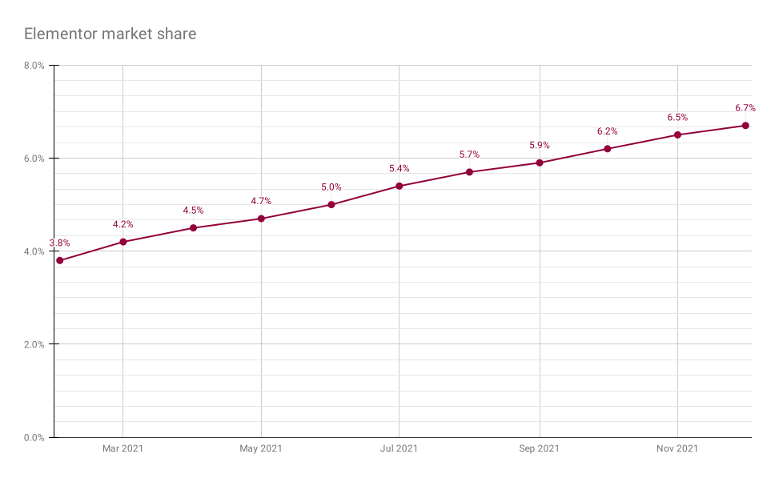
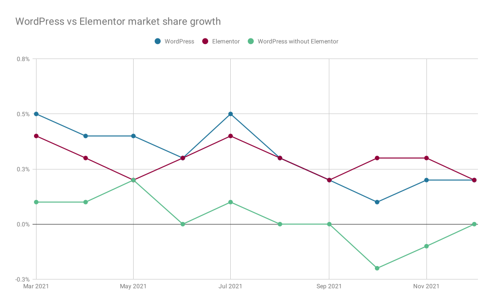

Is [Elementor](/cms/elementor/) the secret behind WordPress’ growth in the last years? We know from my CMS market share analysis that WordPress has been growing fast. Could it be that a lot of that growth is actually caused by Elementor’s popularity?

After I published the sixth iteration of my [CMS market share analysis](/cms-market-share/) last week, some interesting questions popped up in a couple of places. One of them was a comparison to Elementor’s growth. Now I honestly wasn’t aware that W3Techs tracked Elementor, but [it does right here](https://w3techs.com/technologies/details/cm-elementor), apparently since last February. This helped me do a bit of analysis.

## What is Elementor?

Elementor is a page builder. They refer to themselves as a “website builder”, which in my opinion is a bit unfair. Elementor needs WordPress to be able to build websites. Without it, it’s a page builder. It makes building websites with WordPress easier and faster, and it makes it possible to do that without knowing how to code. The latter is probably one of the main reasons why it’s seeing tremendous growth.

Elementor raised $15M in capital in February 2020 and it looks like it’s applying that capital to create enormous growth. They recently launched their hosted version, which makes it truly competitive with services like WordPress.com, Wix and Squarespace.

## How is Elementor doing?

Let’s start with the basic raw numbers. Elementor’s market share growth looks like this for the last 11 months:

Elementor market share within the top 10 million sites of the world.As you can see, Elementor has almost doubled in 11 months time. They are showing *incredible* growth. Note that this is market share of the top 10 million sites in the world, all the [caveats](/cms-market-share/#notes-about-these-numbers) that apply to my CMS market share post apply here too.

## How about other page builders?

W3Techs tracks some other page builders too, all since last February. The most important to note here is WP Bakery, which currently is in use by [6.6% of websites](https://w3techs.com/technologies/details/cm-wpbakery) in their data. What I found interesting is that while WordPress has shown decent growth, WP Bakery basically has seen *no* growth. There are some smaller players, one of whom has seen some growth, that’s Beaver Builder. According to [these stats](https://w3techs.com/technologies/details/cm-wpbeaverbuilder), they now have 0.4% of the market.

## Where’s WordPress’ growth without Elementor?

When you compare all these growth numbers, it immediately becomes apparent what’s happening: Elementor is taking a bigger and bigger part of the WordPress “pie”. In the graph below, I’ve shown the relative growth of the market share percentage of both WordPress & Elementor and compared it with the delta between them: WordPress without Elementor. When Elementor grows 0.1% and WordPress grows 0.1%, the delta is 0%. In a few recent months, WordPress without Elementor has actually *shrunken*.

Elementor sites cannot exist without WordPress, so they are tied to each other. But I think the conclusion is fair that of all those new sites being built with WordPress, a *very* large portion of them is being built with Elementor.

I’ll make sure to make Elementor a part of my CMS market share analysis going forward as it has proven itself to be an important factor.
