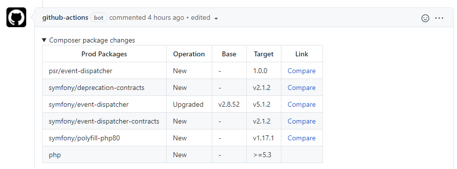
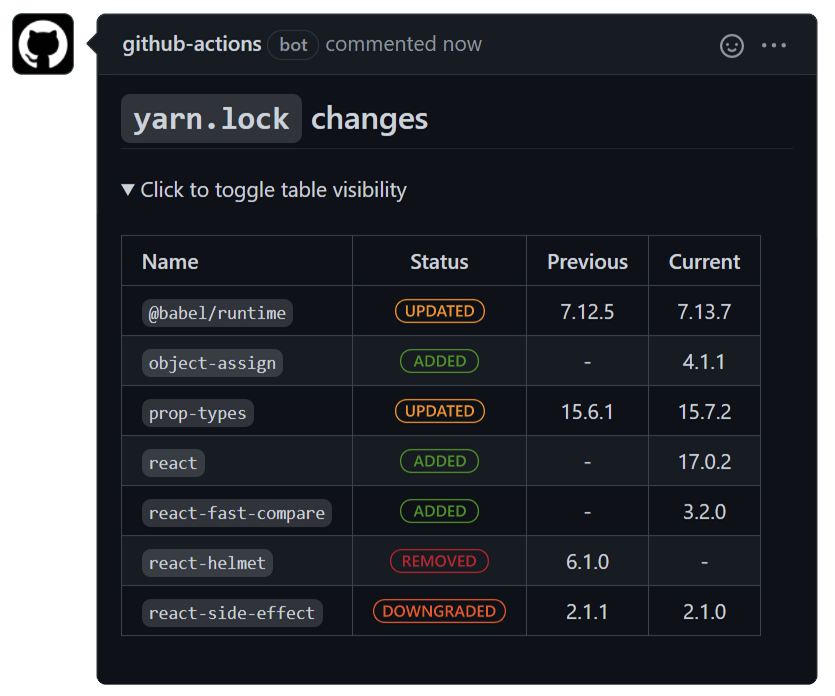
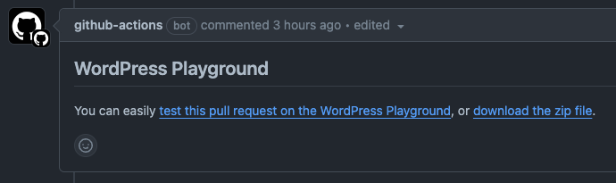

I absolutely love GitHub Actions and have been using them more and more for several purposes. As I’ve seen on some of the GitHub repositories I’ve been looking through, not everybody has as many nice use cases as we have in our repositories, so I thought I’d share some of my personal favorites.

## PHP

### Composer diff

It can be quite hard to see what has been changed in Composer files, especially the lock file, which makes reviewing changes to them in pull requests hard. When added to your repository, this [composer diff action](https://github.com/marketplace/actions/composer-diff) adds a comment to every pull request that touches the `composer.lock` file and gives a human-readable table of changes to the composer file, as in the screenshot below.

### Composer security check

Another `composer.lock` scanning action, this (quite popular) Github action aptly called “[The PHP Security checker](https://github.com/marketplace/actions/the-php-security-checker)” scans your `composer.lock` file for security issues and tells you when you should be fixing them. You can see how we’ve implemented it, for instance, [in our Fewer Tags plugin here](https://github.com/Emilia-Capital/fewer-tags/blob/develop/.github/workflows/security.yml).

### Code style & linting

If you’re coding, you’re making mistakes. Everyone does. But if you’re coding and you’re not doing everything you can to prevent those mistakes, you’re doing it wrong. That’s where code style & linting, and a few more tools come in. The first thing you should be running against your plugin is the [WordPress Coding Standards](https://github.com/WordPress/WordPress-Coding-Standards). The name can lead you to easily misjudge this package. It doesn’t “just” judge that you’ve used the right number of spaces and the right type of naming conventions. It also tells you when you’re using functions that are discouraged, when you’re forgetting to add nonce checks even though you’re dealing with request data, when you’re not sanitizing or escaping strings before output, etc. WPCS is the first thing I run against every plugin I need to evaluate, whether for investment reasons or because I want to run it in one of our own projects.

To run WPCS on every pull request and commit is actually fairly simple. Here’s a [good example implementation](https://github.com/jdevalk/comment-hacks/blob/trunk/.github/workflows/cs.yml).

Another thing you should be running on every commit and pull request is a linter, both for your JavaScript and your PHP. Examples [here (PHP)](https://github.com/Emilia-Capital/fewer-tags/blob/develop/.github/workflows/lint.yml) and [here (JS)](https://github.com/Yoast/wordpress-seo/blob/trunk/.github/workflows/jslint.yml).

## JavaScript

### Package-lock.json & Yarn.lock diff

These actions will make a human-readable version of changes to your `package-lock.json` or `yarn.lock` file, which can otherwise be quite opaque. For Yarn, you can use [this action](https://github.com/marketplace/actions/yarn-lock-changes). I would recommend [a setup like this](https://gist.github.com/jdevalk/da9ac8f2acc6eada6dd10a8b114bc6cf), where it only runs if your `yarn.lock` actually changes. Similarly, you can use [this action](https://github.com/marketplace/actions/npm-lockfile-changes) to create a human-readable comment for your `package-lock.json` file, with a setup [like this example](https://gist.github.com/jdevalk/daa721c3f7af75255f8562820cbaab9a) to only run when the `package-lock.json` file has actually been changed.

## Testing

### PHPUnit

If you have unit tests (you should!!), you can, of course, run them. Feel free to copy [the implementation from our Fewer Tags](https://github.com/Emilia-Capital/fewer-tags/blob/develop/.github/workflows/phpunit.yml) plugin on how we run these.

### Manual testing

For very simple manual testing, I recommend using the WordPress playground (which [I recently wrote about](/plugin-demos-with-the-wordpress-playground/)). I’ve created a [very simple workflow](https://gist.github.com/jdevalk/62d523be19743fd495144ade4c65e54c) action that leaves a comment on every pull request, with a link that opens the zip of that pull request in the Playground. This only works for plugins without a build process, so if you have an autoloader, it should work without that build, or you should adapt the workflow. But it’s proven very useful for quick testing of changes without having to spin up local environments or do *anything* else, really. It looks like this:

It automatically updates the comment after each commit on a pull request, to the latest commit.

## WordPress.org deploy

I’m too lazy to do all the manual Subversion work needed to release plugins; with [10up’s WordPress deploy action](https://github.com/10up/action-wordpress-plugin-deploy), you don’t need to do that ever again. Combine it with a `.distignore` file ([example](https://github.com/Emilia-Capital/fewer-tags/blob/develop/.distignore)) to really create clean deploys to WordPress.org while also having all your WordPress.org assets (headers, icons, screenshots) in a nice `.wordpress-org` directory. In some of the implementations we have, like [this Comment Hacks one](https://github.com/jdevalk/comment-hacks/blob/trunk/.github/workflows/deploy.yml), it even creates a release on GitHub automatically. All I have to do is merge a branch into my `main` branch, tag it with the right version number and commit and push that tag to GitHub, and it does *all* the work from there.

## Share! What are your favorite actions?

I’d love to hear in the comments what your favorite GitHub actions are.
