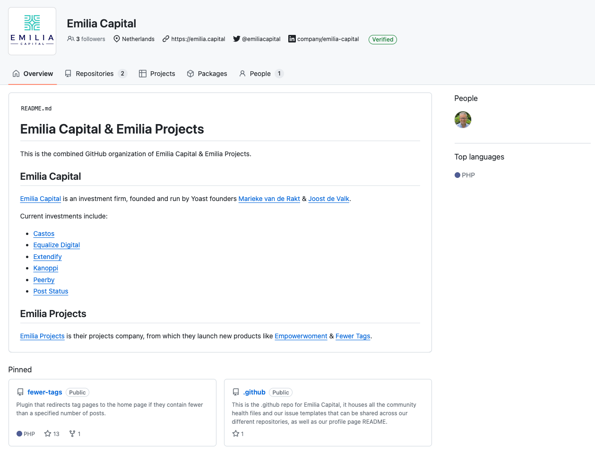
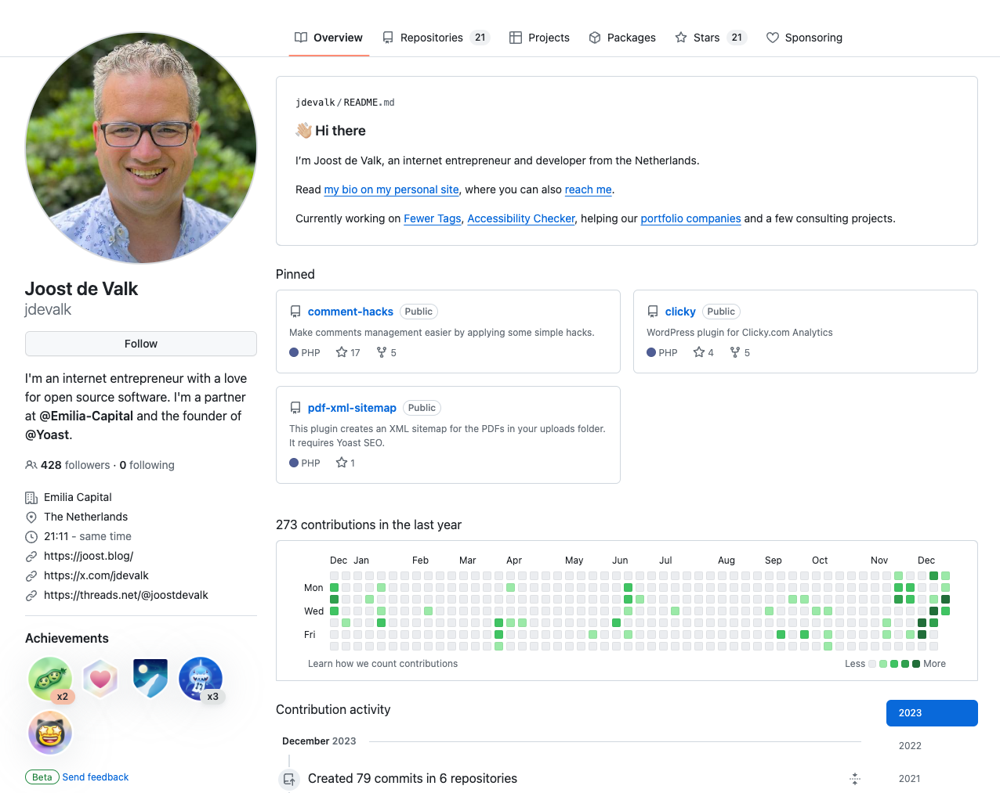

After my [blog post about healthy GitHub repositories](/healthy-github-repository/), I learned that many people didn’t know how to create `.github` repositories and what you can do with those. That automatically also means that you don’t know about organization profile pages, so I wrote a quick post about those, too, which you’re reading now. I’ll start by explaining how to make a good-looking organization page, and then we’ll talk about your [*personal* GitHub profile](#h-personal-github-profile).

## A good-looking GitHub organization page

The Emilia Capital GitHub organization profile is very new and a bit empty, but it already looks quite good:

### 1. Add a profile readme

The fact that this looks good is the result of a few things. First, and most importantly, it’s the `profile/README.md` in our `.github` repository, which renders above our pinned repositories. This allows you to explain who you, as an organization, are and point to interesting links. It’s really as simple as this: create a `.github` repository, which you should for reasons I outlined in my previous post anyway, add a `profile` directory and create a `README.md` file in that directory.

### 2. Pin your most interesting repositories

Of course, ensure those repositories have good descriptions, so people know why they should check them out. In practice, a simple first step is pinning your most starred repositories.

### 3. Add your company URL and social profiles

Go to your organization settings:

- Click your Avatar
- Go to “Your Organizations”
- Click “Settings” for your organization.

Add your company’s URL, a description, and a few social profiles like your organization’s X/Twitter and LinkedIn. Then, make sure to *verify* that organization URL by going to “Verified & approved domains” in the left-hand menu and following the steps outlined there.

## A good-looking *personal* GitHub profile

You can quite simply have a good-looking personal GitHub profile [like mine](https://github.com/jdevalk):

### 1. Create a profile readme

Just like you can create a `.github` repository for organizations, you can create a “magic” repository for your personal profile too. But this repository has a different name: it should be identical to your username. So for me, it’s `jdevalk`, as [you can see here](https://github.com/jdevalk/jdevalk). If you add a `README.md` file to that personal repository, you get the same benefits as the `profile/README.md` does for organization profiles. And then it renders above your pinned profiles as you can see in the screenshot.

**Note**: you can have a `.github` repository for your personal GitHub too. It has *all* the benefits of a `.github` repository for your personal repositories; the only thing that’s different is the method for the profile page.

### 2. Pin some repositories

Here too, you should pin some favorite repositories, and make sure those repositories have proper descriptions. Of course, those repositories should be [healthy GitHub repositories](/healthy-github-repository/) themselves too.

### 3. Set your profile data

Go to your [profile settings](https://github.com/settings/profile) and add your social URLs, website, description, etc. Make sure to do this as it “connects” this repository to your important social profiles and then, create a link back from those social profiles and your website to your GitHub profile too. This makes people trust your profile a lot more.
