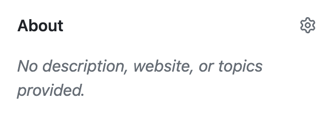

As a result of [investing in a fair few companies](https://emilia.capital/) and getting a lot more requests to invest, I look at GitHub repositories a lot. I often run into GitHub repositories that don’t look well maintained. So, I thought I’d write a small article on what a healthy GitHub repository should look like.

## In this post

- [Repository description and URL](#h-repository-description-and-url)
- [README file](#h-readme-file)
    - [Action badges](#h-action-badges)
    - [What does this thing do?](#h-what-does-this-thing-do)
    - [Installation instructions](#h-installation-instructions)
    - [How do I contribute?](#how-do-i-contribute)
    - [Your readme.txt is not your README.md](#h-your-readme-txt-is-not-your-readme-md)
- [Community health files](#community-health-files)
    - [Hack: a .github repository](#h-hack-a-github-repository)
- [Tags and releases](#tags-and-releases)
- [Branches](#h-branches)
- [Conclusion](#conclusion)

## Repository description and URL

The repository description should not be empty. If you go to your repository and see “No description provided”, it looks like you didn’t care. Click the cog, add a line of text describing the repository, and you’re done.

If you haven’t set a URL for your project, add it now, too.

## README file

A good README should, in my opinion, cover a few things. Let me discuss them in the order I believe they should appear in.

### Action badges

Showing your default actions, like Code Style, Linting, Unit tests, etc., is a good idea. It shows me you care. GitHub [makes this incredibly easy](https://docs.github.com/en/actions/monitoring-and-troubleshooting-workflows/adding-a-workflow-status-badge), so not doing it is a no-go. If you don’t have any actions and this repository is for code, you should wonder why that is. Do you really think you don’t need linting or a code style? Think again.

### What does this thing do?

No long prose is needed here, but one or two paragraphs that explain what the repository I’m looking at is for. It could be similar or the same as the description, but probably slightly longer.

### Installation instructions

If your GitHub repository is public, you say, “Look at my/our code and contribute!” Of course, as a lover of open-source software, I love that. However, how to install your software, plugin, theme, or whatever it might be is often unclear. Your `README.md` should start with, or very quickly, point me to clear and complete installation instructions. What do I do after I check out your code? Do I need to build anything? Please don’t make me read your code to determine your build steps.

### How do I contribute?

The “How do I contribute” section can be tiny, as it should point to your `CONTRIBUTING.md` file, which we discuss below. A special note, either here or under its own heading, should be made about security issues. This should probably point to your security policy, which should live in your `SECURITY.md` file.

### Your readme.txt is not your README.md

WordPress plugins and themes come with a `readme.txt`, that has [specific requirements](https://wordpress.org/plugins/readme.txt). Your `README.md` file should be different. And yes, that means you need both, but I think your `README.md` doesn’t need to be shipped with your plugin or theme; it should describe (how to use/interact with) your repository, which is subtly but distinctly different from your built plugin or theme.

## Community health files

GitHub allows for a fair few different [community health files](https://docs.github.com/en/communities/setting-up-your-project-for-healthy-contributions/creating-a-default-community-health-file). I consider having these the absolute minimum:

- `CONTRIBUTING.md`  
    This file should specify how to contribute, which code style to follow, and what to do and not do when doing pull requests or creating issues. Of course, you should have [pull request templates and issue templates](https://docs.github.com/en/communities/using-templates-to-encourage-useful-issues-and-pull-requests/about-issue-and-pull-request-templates) to guide these processes as well.
- `SECURITY.md`  
    This file should first clarify where to report security issues and how quickly you expect to respond. It may contain more info, but this is the most basic requirement.
- `CODE_OF_CONDUCT.md`  
    It’s smart to have a code of conduct. It’s easy to point to when you get unwanted behavior and also provides you with a guideline on how to handle problems. You don’t have to develop one yourself; I’d suggest using the amazing [contributor covenant](https://www.contributor-covenant.org/).

### Hack: a .github repository

If you create a `.github` repository for your organization, you get to set up “default” health files for all your repositories in one go. See [the Emilia Capital .github repo](https://github.com/Emilia-Capital/.github/) as an example. This lets you set up default issue and pull request templates for all your repositories as well, which is super convenient.

## Tags and releases

If you release software, I expect you to tag those releases in your repository, so it’s easy to find them, preferably with downloadable zips and a proper changelog. Far too often, I run into WordPress plugins that don’t do this and make life more complicated than it needs to be.

It’s smart to add a `.gitattributes` file to your repository, one of the things you can do with that file is define which files should be `export-ignore`, so they’re not in your zip files.

## Branches

If you have dozens or more stale branches on your GitHub repository, I will know (or assume) that you’re not in control. Clean them up. Delete no longer necessary branches, set a reminder for yourself to do this every so often, and make sure that you’re in control of all of them.

## Conclusion

Clean up! This is your workspace, but most importantly, the space where you either foster collaboration or shun it.

**Be sure to check out the sequel to this post: [good-looking GitHub profile pages](/good-looking-github-profile-pages/).**
