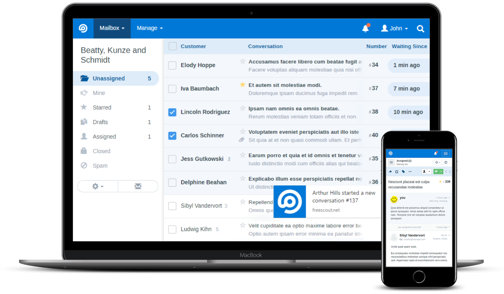

## Migrating from SaaS to open-source

Everyone uses a lot of SaaS applications to manage their day-to-day business. So much that the cost of it becomes prohibitive. I’ve decided that I’m going to try to move as much of the software we use to run [Emilia Capital](https://emilia.capital/) from SaaS to open-source and self-hosted solutions as possible. I will document every step because this might help others do the same.

The first step I took was moving from [HelpScout](https://www.helpscout.com/) to [Freescout](https://freescout.net/). Email is still a very important process for us, as both the legal processes around investing and the invoicing processes of all our businesses are still tied to email. So, we were using HelpScout to manage that. When I started looking for an open-source alternative, Freescout immediately turned out to be a very solid system that was also incredibly easy to install. Since it looks incredibly similar, the switch was easy on our team.

## The software

Freescout is based on a traditional PHP + MySQL stack, with either NGINX or Apache in front of it. The [install instructions](https://github.com/freescout-helpdesk/freescout/wiki/Installation-Guide) are simple, because installing it really isn’t hard if you’ve ever done some work on a server. There are also packages for installers like Softaculous and Fantastico. You’ll need to ensure you have all their required PHP modules, but the installer makes it easy to see which modules you still need.

I set Freescout up using [Postmarkapp](https://postmarkapp.com/) as an SMTP server for the outgoing email because I don’t want to use Sendmail or something like that on my server and consider email reliability super important. In reality, you can probably set that up fairly easily too.

For the incoming mail, I used simple free Gmail accounts. Here there’s an important trick to know: first, create those accounts. Then, enable 2-factor authentication and create an application password in your Google settings (go to 2-factor authentication in your Google account and scroll down). Then go into Gmail for that account and enable IMAP. Then use that application password to log in to your Gmail account from Freescout, and everything should work seamlessly.

### Modules

I added the following modules to our setup for now:

- [API & Webhooks](https://freescout.net/module/api-webhooks/) (needed for the migration)
- [Extended Attachments](https://freescout.net/module/extended-attachments/)
- [Reports](https://freescout.net/module/reports/)
- [Saved replies](https://freescout.net/module/saved-replies/)
- [Tags](https://freescout.net/module/tags/)
- [Workflows](https://freescout.net/module/workflows/)

## The benefits

There are a few benefits to self-hosting Freescout that might not be immediately obvious. Of course, there are economic advantages; more on that below. There are also legal advantages: all the data is on your premises. No need to tell users that you’re using a third-party service for support interactions.

I think the biggest benefit for us as a company is the liberty to create more users and inboxes when we need them and not be bound by very restrictive account limitations or prohibitive costs. Which brings us to the economics:

## The economics

### The cost of HelpScout

I’ve been a HelpScout customer for over a decade, we were big users at Yoast, but their pricing started annoying me more and more. We were paying $80 per month for 4 standard user accounts. We needed more than two inboxes, but we decided against using more and changed our process a bit because the cost would otherwise have gone up to $160 a month.

So, over a year, the TCO (Total Cost of Ownership) of HelpScout would be 12 \* $80 = $960. As our company grows a bit, that cost would go up. Had I used it the way I’m now using Freescout, I’d have 2 more users and more inboxes; the total cost per year would have been $2,880.

### Cost of Freescout

For Freescout, since we host it on a server I already had running for other things, it’s free. But realistically, the monthly cost is like $5 for a [Vultr server](https://www.vultr.com/?ref=9597032-8H) that can run this (that link gets you $100 credit to test Vultr and gives me some credit, too). On top of that, you need an email account to receive the emails. As I mentioned, I just used free Gmail accounts for that.

I did spend some money on modules for Freescout. They’re one-time costs, as they have lifetime licenses. The total cost of that was $67.94. The most expensive step was the data migration. You could probably do that yourself if you wanted to, but I used [help-desk-migration.com](https://help-desk-migration.com/) to get it done in under an hour. Cost of that: $375.

ItemCostServer cost per year$60.00Modules – one-time fee$67.94Migration$375.00**Total cost of the first year****$502.94****Total cost second year****$60.00**As you can see, the ROI of changing to Freescout will be positive in the first year. In the 2nd year, this is a very big cost reduction.

## Conclusion: success! What’s next?

I’ll call this one a win. I hope it inspires companies to do the same. I’ve got quite a few other services I’m considering for the next step, but I’m open to your suggestions: what should be next?
