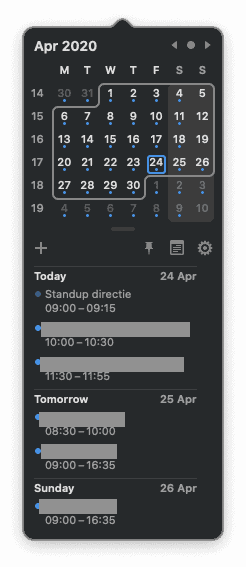
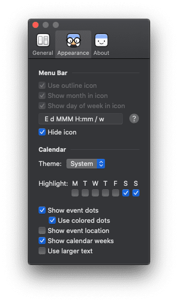
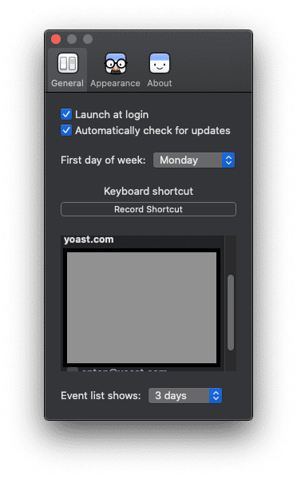
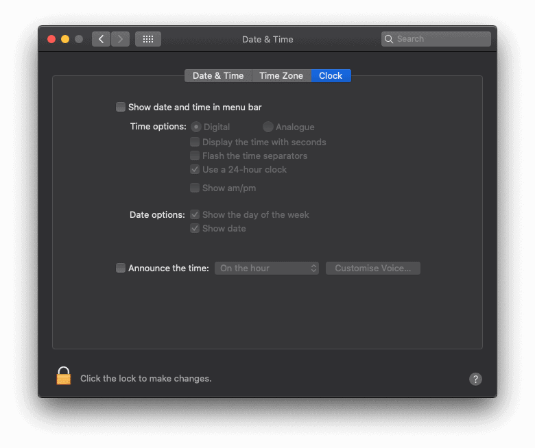

This post explains how to get the week number in your Mac’s menu bar. Simple enough, right? At some point, as you start planning ahead in basically anything, you’ll run into “week numbers”. Week numbers are weird in that they’re not in your head all the time. But you do need to look them up more than you want. I ran into this and decided: there must be a way to solve this. And there is.

On my Mac the menu bar looked liked this:

And what I wanted was for the week number to be next to the date, in the top right. So first I looked in the Mac’s date settings (System Preferences -> Date & Time), but unfortunately, it doesn’t allow for this. So I started Googling. Quickly I found this tool called [Itsycal](https://www.mowglii.com/itsycal/).

So, I set out to change this.

1. **First, we install Itsycal**Itsycal is a nice, free, calendar integration in your menu bar, for me it looks like this when I open it, showing a nice outline of my next 3 days:
2. **We configure Itsycal to show the week number**Copy the top settings, under “Menu Bar” from the screenshot below. The content of the field is `E d MMM H:mmm / w`
3. **Make sure Itsycal starts on system boot**To make sure all of this isn’t gone when you reboot your Mac, check the box on the General tab next to “Launch at Login”:
4. **The menu bar should update**And it should now look something like this, with the Week number nicely showing after the date and time, on the left:
5. **Get rid of the default calendar**Open System Preferences and go to Date & Time, uncheck “Show date and time in menu bar”. This takes the default date & time *out* of the menu bar.
6. **Move the date & time to the right**You don’t have to do this if you’re fine with the date & time on the left of your icons, but personally I dislike that. Luckily it’s very simple to rearrange your menu bar. Just press & hold `cmd` on your keyboard and then drag the date & time to the right:

That’s it! Now you have the date in your menu bar, just the way you want it, *with* the week number.

Happy to have your week numbers showing now? Find other quick improvements like this: check out my [productivity hacks](/category/productivity-hacks/).
