## Introduction 

Recent observations have highlighted a significant surge in new plugin submissions to the WordPress repository, as noted in [this post](https://make.wordpress.org/plugins/2025/05/21/the-wordpress-ecosystem-is-growing-new-plugin-submissions-have-doubled-in-2025/). We also know that Automattic recently “unpaused” their contributions, leading to some pretty critical articles like [this one from Roger Montti](https://www.searchenginejournal.com/wordpress-unpauses-development-but-has-it-run-out-of-time/548199/).

The increase in plugin submissions got Marieke and me wondering about the relationship between plugin submission, actual plugin availability, and innovation within the WordPress ecosystem. As a result of all the recent changes, WordPress core releases can be somewhat sporadic. Marieke and I wanted to explore whether plugins are now the primary driver of innovation. Marieke took it upon herself to investigate how much plugin development contributes to WordPress’s evolution by going through heaps of changelogs, while I grabbed and analyzed a lot of data from WordPress.org.

## Problem statement and research questions

While we see an increase in plugin submissions, it’s unclear if this translates to a proportional increase in plugin installations and overall platform innovation. Many plugins in the repository have minimal installations, suggesting a potential disconnect between plugin development and actual user adoption. With this in mind, we’re asking these research questions:

- **RQ1:** To what extent do new WordPress plugins achieve downloads and active installations, and how do plugins contribute to the innovation of the WordPress platform?
- **RQ2:** Do WordPress plugins compensate for the lack of innovation within WordPress Core?

## Preliminary data analysis

When we started digging into the data we gathered from WordPress.org, we found a more nuanced picture than the report suggested. While 2025 apparently shows a notable increase in plugin *submissions*, historical data indicates peak plugin additions in 2015 and 2016 (see Figure 1). Remember that Figure 1 only accounts for plugins that were approved in those years and are still active in the repository; total plugin submissions for those years were likely higher.

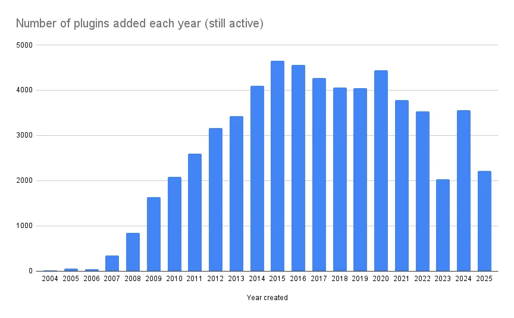Figure 1## Analysis of all plugins on WordPress.org

To answer research question 1, we analyzed the number of active installs for plugins, grouped by their year of addition to WordPress.org. Figure 2 shows that plugins added in more recent years have far fewer active installs than plugins released years ago. Of course, plugins take some time to grow, so it’s logical that plugins released in 2025 have fewer average installs than those released in, say, 2015. But you might *also* expect that plugins released *now* are adding features that people need and would thus grow faster. That doesn’t seem to be happening though.

It appears that it takes years for most plugins to reach a significant user base, if they ever reach it. Plugins released earlier might have had an outsized chance of acquiring users, while new plugins are basically never showing up in search results. Only the ones with external factors (like being recommended by a popular theme or plugin) grow quickly.

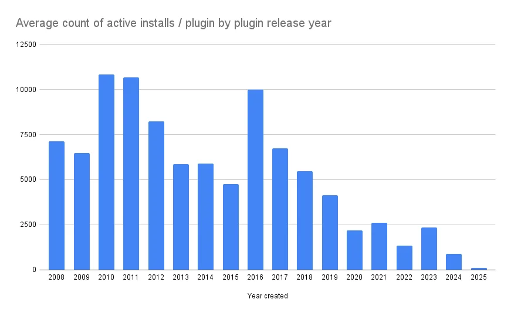Figure 2## Analysis of big plugins

In order to further research our questions, we did an analysis with only the big plugins. In order to make some kind of impact on WordPress as an ecosystem, plugins need to have at least some users. That’s why we looked at all plugins with over 100,000 active installs. What we saw from that analysis is that only five of the big plugins were released in 2024, and just one in 2025. Again, it makes sense that plugins from recent years have fewer installs, but it does suggest that it is hard for new innovations to reach the WordPress userbase through the release of new plugins.

At the end of this post, we’ve some more thoughts about why some new plugins do and some plugins don’t attract a substantial user base.

## Analysis of established plugins

It appears that innovation does not come from new plugins. We’ve also established that it does not come from WordPress core. Established plugins maintain a dominant presence in the market, potentially due to longer market tenure, branding efforts, and security hardening.

We’ve looked at the distribution of large plugins and analyzed to what extent plugin usage is linked to the bigger, more established plugins. In our analysis (results in table 1) we researched to what extent the total number of installs (of all plugins across the ecosystem combined) could be accounted for by the larger plugins.

Table 1 reads as follows. In the first column, you’ll read the group of plugins (for example plugins with more than 10 million installs). In the second column, you’ll find the number of plugins in that group, in the third column, you’ll find the number of users from that group and the groups above combined. You can see the cumulative sum of the plugins and the % of installs they have (of the total number of installs throughout all WordPress sites).

Table 1 highlights the concentration of active installations within a few major plugins. This implies that innovation efforts are likely to have the greatest impact within these widely adopted plugins, rather than in the long tail of less installed plugins.

**Group****\#****Cum. #****Cum. sum****% installs****% plugins****Plugins with > 10M installs**4440,000,00011.52%0.01%**Plugins with > 5M installs**71182,000,00023.61%0.02%**Plugins with > 2M installs**2132137,000,00039.45%0.05%**Plugins with > 1M installs**3769174,000,00050.10%0.11%**Plugins with > 500k installs**66135215,900,00062.17%0.21%**Plugins with > 100k installs**361496276,300,00079.56%0.78%**Plugins with > 10k installs**1,9712,467327,120,00094.20%3.86%**Plugins with > 1k installs**5,6208,087343,199,00098.83%12.65%**Other plugins**52,60382.30%Table 1

You’re reading that correctly: a group of 4 plugins (less than 0.01% of all plugins) is responsible for about 12 % all plugins installed on WordPress sites worldwide. And, 69 plugins (all having more than a million installs) account for half of the total installs. The usage of plugins in WordPress is highly skewed towards big, well-established plugins.

This leads to the following conclusion: if the big plugins have the most users, then they are the ones that could (and should) drive WordPress innovation. And not the small plugins that hardly anyone uses (yet). So, we need to investigate how these big WordPress plugins are doing in terms of innovation.

### Analysis of changelogs

We’ve come to the next step of our analysis, which contains a lot of dull research work. This research employs an analysis of plugin changelogs to assess the extent of innovation within big plugins. Marieke spent hours and hours going through changelogs and classifying them. Examining the release notes for plugins included in this study, changes such as “new features” and “enhancements” are documented over time. It is acknowledged that the terminology used in changelogs varies. Therefore, this methodology is primarily for longitudinal intra-plugin comparison (so with themselves) rather than inter-plugin comparison (with each other).

This is not scientific research (at all). Marieke tried to look at different big plugins while using her background knowledge as a researcher and a WordPress person. We chose plugins that are well-known and that we know well, while trying to get different plugins from different areas. We could have chosen different ones. Marieke wanted to include Learndash too, but couldn’t parse their changelog. Consider this a deep dive into what important brands in the WordPress world do innovation-wise. It’s not complete, but it indicates what’s happening.

## Plugin innovation

### The Big Automattic Plugins

Looking at WooCommerce, we see they released many new features from 2021 onwards. However, this year they seem to be behind schedule. Perhaps they’re planning something significant, but it does look a bit concerning for 2025.

Also, for Jetpack, 2024 was a low point since 2019, and 2025 isn’t looking much better regarding new or enhanced features.

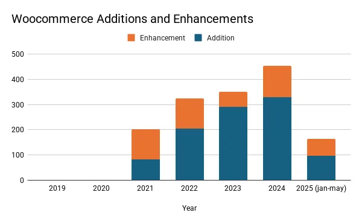    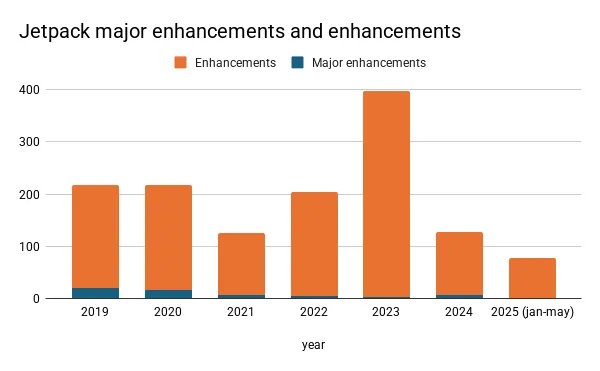    ### The SEO plugins

The three major SEO plugins, Yoast SEO, Rank Math, and All in One SEO (AIOSEO), are substantial projects with large codebases and extensive functionality. They account for over 16 million active installations according to .org’s public numbers (Yoast SEO: 10+ million, Rank Math and AIOSEO: 3+ million each).

Since 2021, Yoast SEO has introduced fewer enhancements, with a notable decline in 2024, and early indications for 2025 suggest a continued downturn. Rank Math exhibits a similar trend, with a marked slowdown in innovation during 2024 and 2025. In contrast, AIOSEO experienced a surge in new features in 2024, but projections for 2025 (based on changelogs so far) also indicate a significant decline.

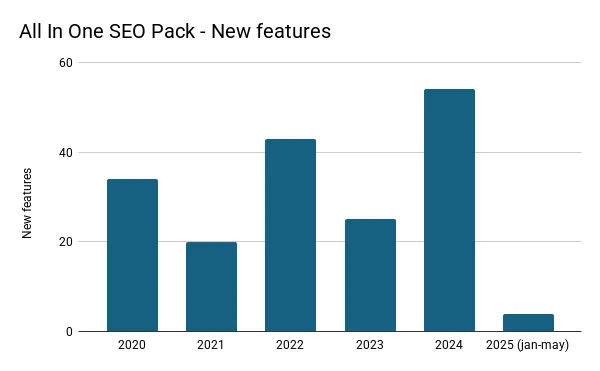    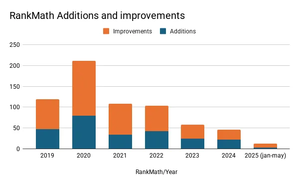    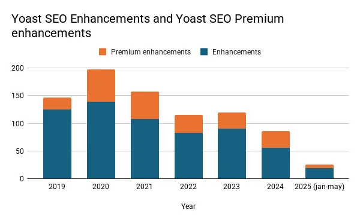    ## Other notable plugins

Marieke then further analyzed the innovation trends of five other notable plugins, revealing a mixed picture. WP Rocket and Elementor have demonstrated steady, consistent innovation, although 2025 shows a slight slowdown, possibly indicating an upcoming major release. Contact Form 7 has exhibited a gradual decline in innovation since 2022. Easy Digital Downloads (EDD) experienced a growth in new features during 2024, yet 2025 appears to lag behind. GiveWP, on the other hand, has maintained a relatively stable pace of innovation. While 2025 shows a dip, this pattern mirrors 2022, and innovation rebounded in 2023.

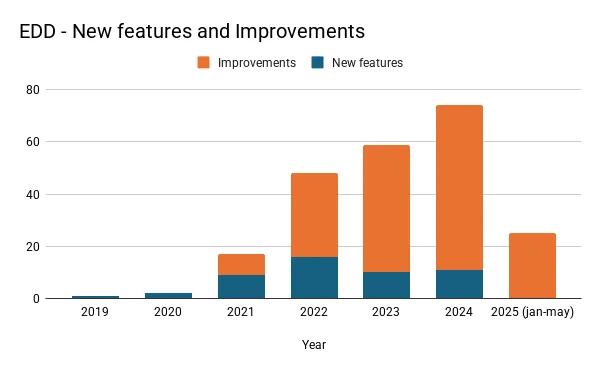    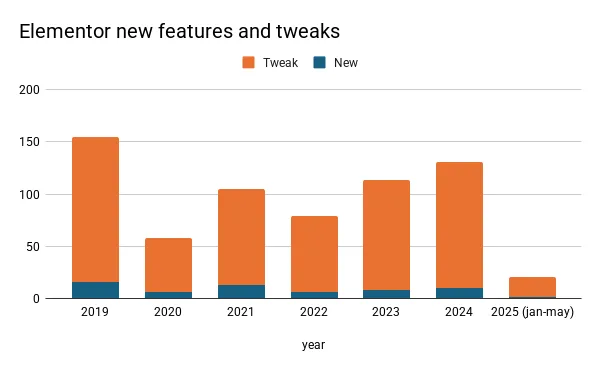    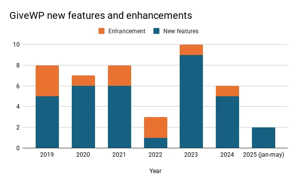    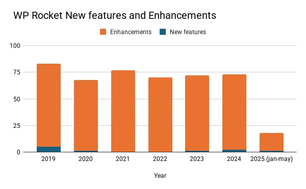    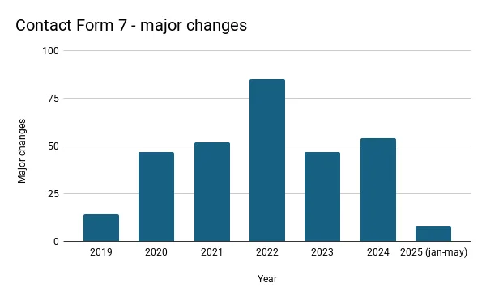    ## What does this mean?

The current state of innovation within the WordPress ecosystem is concerning. Core updates have slowed, and contributions from key players are either leveling or even declining.

While new plugins could theoretically drive innovation, they tend to have limited adoption and install bases. Meanwhile, established plugins, particularly in the SEO space, are not showing signs of renewed innovation; in fact, many are introducing fewer updates than in previous years, and the outlook for 2025 is not promising. This stagnation poses a risk to WordPress’s competitive position in the broader market.

### Why don’t new plugins find new audiences?

As said, only 5 plugins in 2024 and 1 plugin in 2025 have crossed the 100,000 installs mark. These plugins are:

**Released****Active installs****Plugin****Built & promoted by**20241,000,000+[Image Optimizer](https://wordpress.org/plugins/image-optimization/)Elementor2024500,000+[WooCommerce Legacy REST API](https://wordpress.org/plugins/woocommerce-legacy-rest-api/)WooCommerce2024200,000+[Omnisend](https://wordpress.org/plugins/omnisend/)Omnisend2024200,000+[SureForms](https://wordpress.org/plugins/sureforms/)Astra / Brainstorm Force2024100,000+[Site Mailer](https://wordpress.org/plugins/site-mailer/)Elementor2025100,000+[SureMails](https://wordpress.org/plugins/suremails/)Astra / Brainstorm ForceAll of these plugins reached their size because of either an enormous marketing effort (in the case of Omnisend) or because they were promoted by other major plugins or themes.

The WooCommerce legacy REST API plugin restores a feature that WooCommerce removed. As of this writing, it hasn’t been tested with the last three major releases of WordPress, which means it was released and then not maintained anymore.

With so many plugins available and many of them not offering excellent quality, how are users supposed to find the truly innovative, useful ones? That’s why we need to do a better job promoting high-quality, innovative plugins in the repository and at events like WordCamps. We should share ideas, show each other how we’re improving WordPress, and celebrate our wins as a community.

Bigger plugins with large user bases and solid business models should also be encouraged to keep innovating, perhaps even by teaming up with new, promising plugins. Hosting providers could play a key role too, by identifying great plugins and helping their customers discover them.

Together, we can ensure WordPress keeps growing and stays an excellent platform for everyone.
