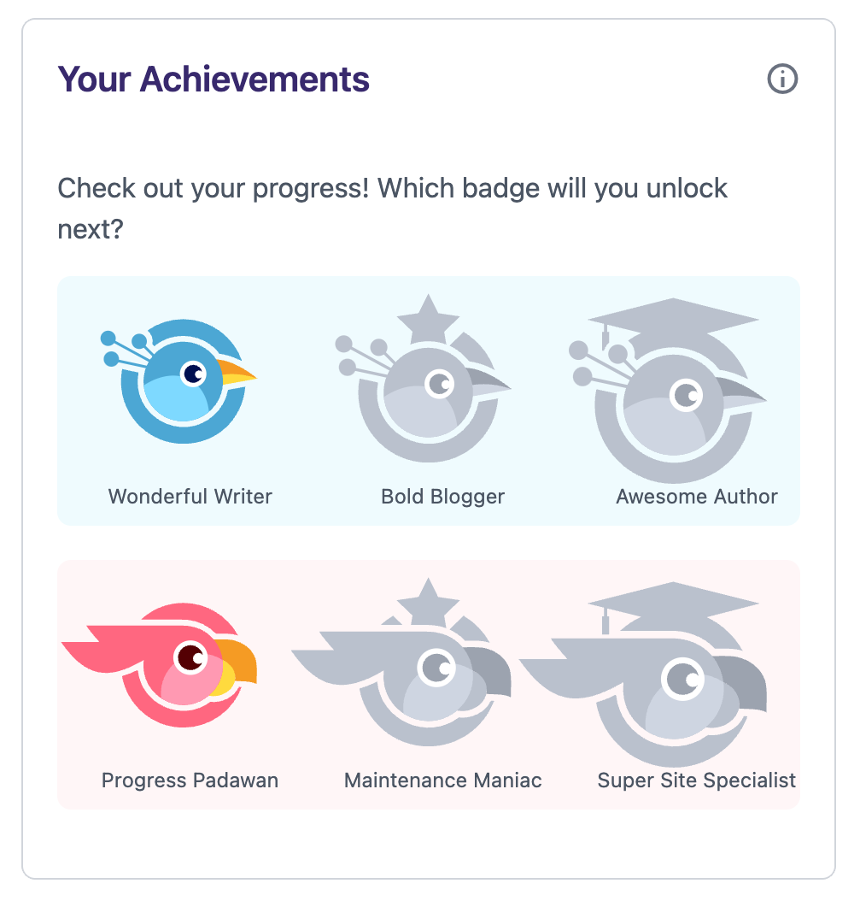
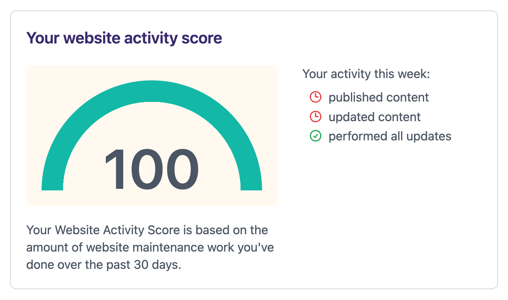
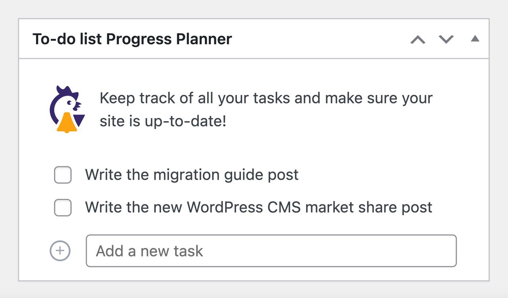

Ever since Marieke and I left Yoast, we’ve considered building a new WordPress product. We love working on something that people can use—something that will improve their website or make working on their website easier. About a year ago, we came up with something, and we’ve been playing with that idea ever since. We’ve been creating and developing in the past few months, and today, the first version is done! Let me tell you everything about Progress Planner!

# Planning and organizing

Both Marieke and I aren’t particularly good at planning and organizing. [Marieke noticed that when leaving Yoast](https://marieke.com/hyperfocusing-on-procrastination/). Over the years, we have built-in strategies and tactics for getting our own work organized. Managing a website consists of all these tasks that people easily forget or postpone. Could we build something that would make working on your website easier and more fun? Something like Duolingo or Fitbit for your website. That’ll keep you motivated to update and add stuff.

So, that’s what we did. We built a plugin that motivates you to keep up the work on your website. We give you all kinds of stats on your activity, and you can unlock badges and keep streaks. Your activity score will go up if you update plugins or add content. Every Monday, we’ll email you with your progress and motivate you to keep going.

A screenshot of Progress Planner’s first badges# Pro version: helping people even more

There will be a Pro version at some point later this year. We’re already developing features for that. Our idea is that in addition to motivating people to keep going with their websites, we should also help them with the work. We’re building several mini-courses that will be accessible from the WordPress backend, right in the edit screen. In those courses, we’ll help people how to draft or improve certain pages. How do you write a proper ‘about’ page? What does a good FAQ page contain?

In addition to these courses, we’ll give people direction and help them decide what task to start next. We’ll also help them set goals and come up with proper to-do lists. The whole website maintenance thing can be rather overwhelming. We want to direct people to what tasks to take on next.

A screenshot of Progress Planner’s Website activity score# Small features – significant improvements

We’ve made a nice dashboard in the WordPress backend that allows for a small to-do list and will tell you when to update your plugins. Marieke updated the plugins on her site for the first time (I usually take care of it because she keeps forgetting). You’ll collect points for updating, which motivated her to do it herself. This is going to save me a lot of work!

We’ve also added a to-do widget to the WordPress dashboards, allowing you to write down the tasks you want to work on and see them every time you log into your site. This is a small feature, but it will certainly help *me* to remind myself of the things I need to get done on my site.

A screenshot of Progress Planner’s to-do list dashboard widget# Try out our beta!

We’ve *just* released the very first version of Progress Planner [on WordPress.org](https://wordpress.org/plugins/progress-planner/). We’re very excited because it looks amazing and already helps us keep working on our websites. We even get a little competitive! Please try out the beta version of Progress Planner and let us know how to improve it further.
