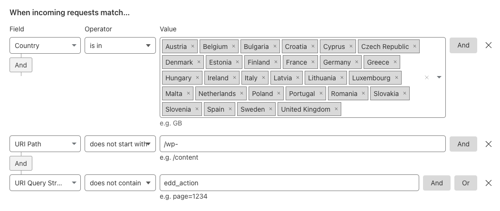
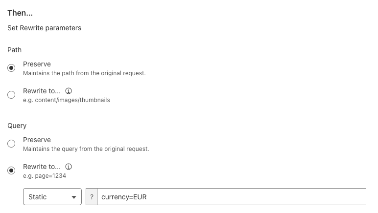

We’re getting ready at Emilia Projects (which is the “run our own projects part” of [Emilia Capital](https://emilia.capital/)) to sell our first plugin, the Pro version of [Fewer Tags](/plugins/fewer-tags/). We will sell that using [Easy Digital Downloads](https://easydigitaldownloads.com/) (EDD), which I have not used for *years,* so I’ve been re-learning how to work with it. One of the things I’d found they had added since I started using it is a very nice [multi-currency plugin](https://easydigitaldownloads.com/downloads/multi-currency/).

The plugin works mostly by adding `?currency=<currency>` to the URL and allowing people to switch using that, but… I don’t necessarily want people to switch. We have two currencies, Euros (`EUR`) and US dollars (`USD`) and I want to give everyone in Europe `EUR` and everyone else `USD`. So, the default currency of the site is `USD`, and we needed to find a way to make people in the EU default to `EUR`. That’s where Cloudflare comes in!

I started with an approach using [cookies and a worker](https://gist.github.com/jdevalk/bb3efd2932bb45bec885149017d278e0), but this has the downside of not allowing Cloudflare caching to work properly, as the page differs depending on where you come from, but the URL doesn’t change. Thankfully Jono pointed this out to me when I was discussing it with him, and he pointed me towards transform rules.

## Cloudflare transform rules

Cloudflare has added a *very* nifty feature called transform rules that allow you to change URLs based on a number of variables. One of them is the country that people are visiting your site from. So, I created a transform rule that adds `?currency=EUR` to every URL on the site for visitors from the EU (and GB). Here’s the “request match” part of that rule:

Clicking this together in Cloudflare can be some work, so here’s the full expression. You can just put that in by clicking “Edit expression”:

```plaintext
(
  ip.geoip.country in { "AT" "BE" "BG" "CY" "CZ" "DE" "DK" "EE" 
   "ES" "FI" "FR" "GR" "HR" "HU" "IE" "IT" "LT" "LU" "LV" "MT" "NL" 
   "PL" "PT" "RO" "SE" "SI" "SK" "GB" }
  and not starts_with( http.request.uri.path, "/wp-" ) 
  and not http.request.uri.query contains "edd_action"
)
```

The first bit is simple: target everyone in these countries. The second “And” ensures you can still use your WordPress admin properly, and Cloudflare doesn’t add the query string we’re about to add to JavaScript that might be loaded, images, etc. The third “And” ensures you can still add and remove items from your cart and do other things. You might need to adjust this a bit for your site if you have other query parameters specific to your site.

And here’s the “Then” part of this rule:

What’s probably not immediately clear to you but is super valuable: **the user does not see that `?currency=EUR` is secretly being added to the URL**! It only gets added in the communication between CloudFlare and your server and not towards the user. So, the cache is different because the URL that CloudFlare is requesting is different, but the user sees the exact same URL as his friend in the US! This isn’t just great for the user but also for your SEO *and* your caching.

## Displaying the right price

Now, the next challenge is displaying the right price and the right currency! Luckily, EDD has a shortcode for that: `[edd_price id=<ID of download>]`; this will output the price correctly. So, you need to drop the habit of mentioning price straight in your copy and instead use that shortcode everywhere. And yes, you can use that shortcode within blocks, for instance, buttons. Doing this in the editor:

Will show this on the front of the site:

Or this if you’re from the US:

## You don’t need a currency switcher!

By doing this, I would argue you do not need a currency switcher dropdown or buttons on your EDD site, and you can give people the correct currency, depending on where they come from, without any coding!

Props: thanks to my colleague [Ari Stathopoulos](https://github.com/aristath) for helping me with some of these bits and to [Jono Alderson](https://www.jonoalderson.com/) for his advice!
