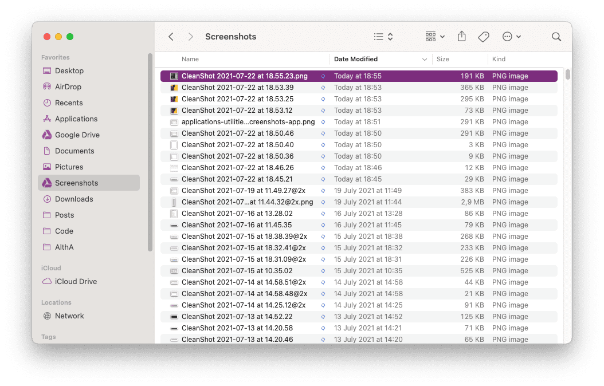
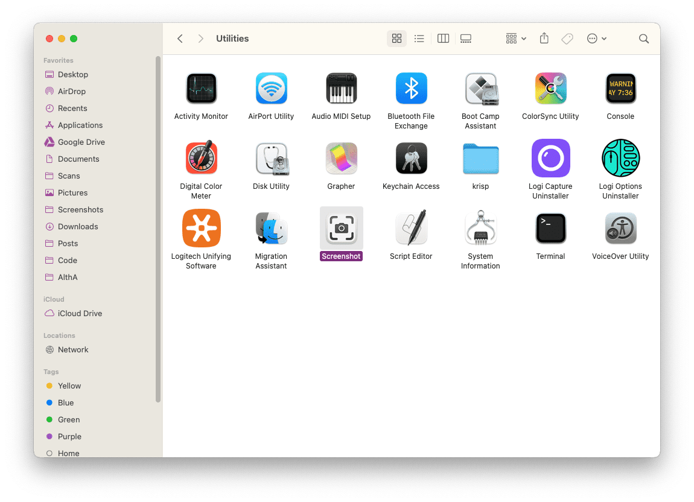
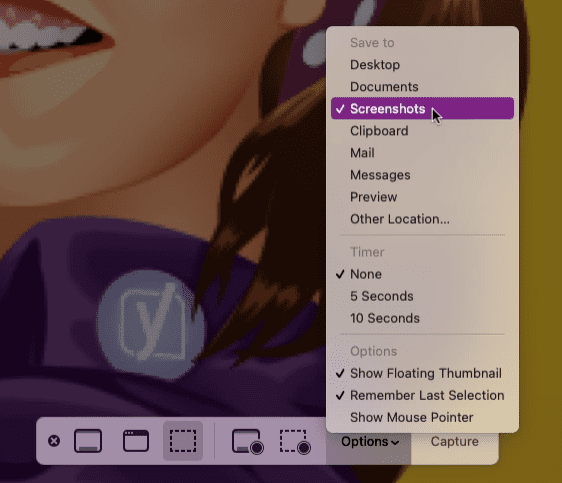
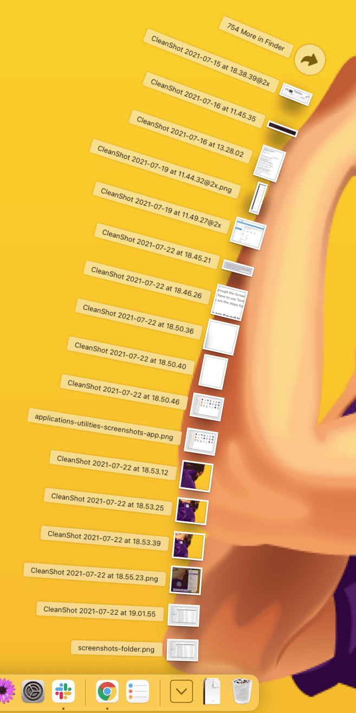
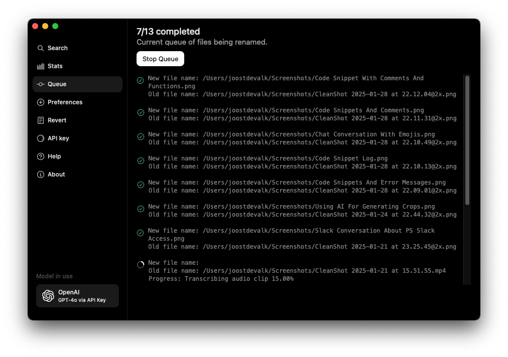
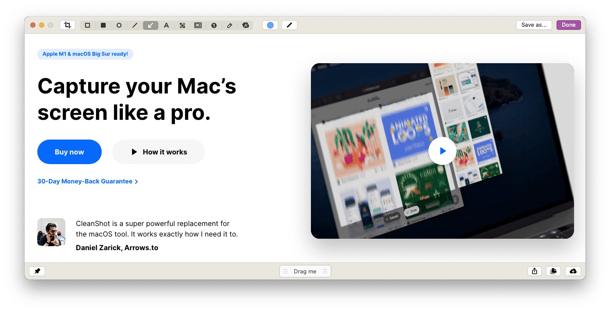

MacOS has great built-in screenshot functionality. The problem is that, by default, it saves screenshots to your Desktop, which in my case turned my Desktop into a mess. I fixed this a while ago and today realized that this wasn’t an obvious thing for everybody, so I quickly wrote this blog post.

Time needed: 2 minutes

Let me quickly teach you how to improve your screenshot workflow and keep all your screenshots organized a bit better:

1. **Create a screenshots folder**For me, my Screenshots folder is a folder in my Documents folder, that syncs to my Google drive. I’ve also dragged it into my left-hand sidebar in the finder, for easy access.
2. **Open the screenshots app**Either press ⌘-Shift-5 or open the Screenshots app from the Applications/Utilities folder.
3. **Set the screenshots folder as your screenshot destination**You might have to select “Other location” and find it.
4. **Easy access: stack in your dock**If you want to easily access your screenshots, drag the folder to your dock. If you right click it, you can select “View content as” and set it to “Fan”, and set “Sort by” to “Date Modified”, and you get something like this:
5. **Automatic renaming**Recently I’ve started using [Keep it shot](https://keepitshot.com/) to automatically rename my screenshots.
6. **Bonus: better screenshots**My screenshots got even better and more useful when I started using [CleanShot X](https://cleanshot.com/) (not getting paid for this). It changed some of these things a tiny bit but the setup with my Screenshots folder and the fanning stack is still what I use every day.

## Save your screenshots on Google drive

If you want even better organization for your screenshots, you should sync your screenshot folder to Google drive. It’ll OCR all the image automatically, allowing you to search for the text on those images in your Google drive. It makes finding screenshots after a few weeks an absolute breeze.

Happy that your screenshots are now organized and want to see other MacOS productivity tips? Check out my [productivity hacks category](/category/productivity-hacks/).
