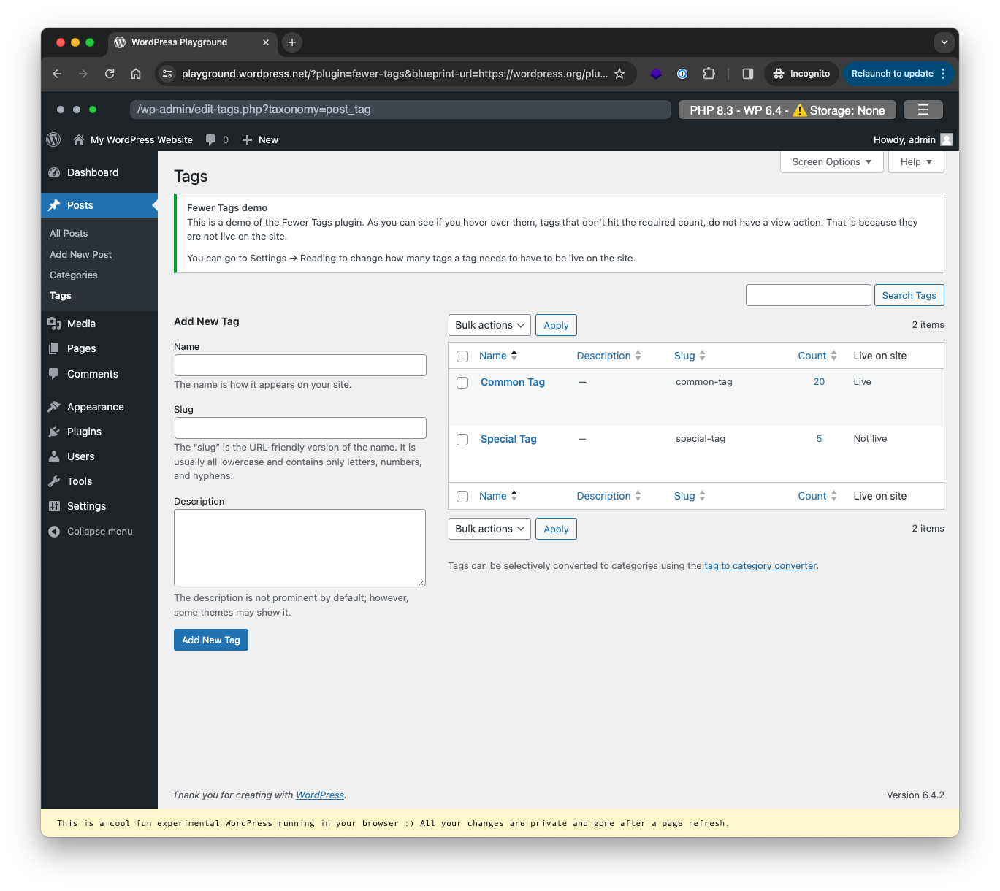

For years, plugin developers have been looking for ways to demo their plugins to users. Users don’t read `readme.txt` files or plugin pages on WordPress.org. They want to try and see a plugin in action for a bit, which is a much better way of seeing whether a plugin solves your problem. The new [WordPress playground](https://developer.wordpress.org/playground/) is a perfect way of doing that. So, the meta team at WordPress.org started building a preview button. While the first iteration was not ideal, a few weeks ago, @Tellyworth posted on Make WordPress about the [revisited Playground experiment](https://make.wordpress.org/meta/2023/11/22/plugin-directory-preview-button-revisited/). I, of course, started playing with this feature, and now I can’t wait for it to go live for all users.

First, let me show you what I’ve created. [Click this link to open the Fewer Tags playground](https://playground.wordpress.net/?plugin=fewer-tags&blueprint-url=https%3A%2F%2Fwordpress.org%2Fplugins%2Fwp-json%2Fplugins%2Fv1%2Fplugin%2Ffewer-tags%2Fblueprint.json%3Frev%3D3010033) in a new tab.

As you’ll see, this opens a WordPress Playground, with [Fewer Tags](/plugins/fewer-tags/) installed, like in the screenshot above. But it does more. It brings you to the correct page for you to see what Fewer Tags does (the edit tags page), *and* it loads a notification that explains what you can do there. This notification *only loads and shows on Playground sites*.

Let me explain to you how to do this:

## Define a blueprint file

In the `assets` directory of your WordPress plugin’s subversion checkout, create a subfolder called `blueprints`. In that folder, create a file called `blueprint.json`. You can keep this file incredibly simple. The file for Fewer Tags is here, and it reads just this:

```json
{
	"landingPage": "\/wp-admin\/edit-tags.php?taxonomy=post_tag",
	"steps": [
		{
			"step": "login",
			"username": "admin",
			"password": "password"
		},
        {
			"step": "defineWpConfigConsts",
			"consts": {
			  "IS_PLAYGROUND_PREVIEW": true
			}
		}
	]
}
```

As you can see, all it does is define our landing page, define a constant we’ll use below, and log the user in so they can skip that step. Everything else is done with another bit of magic.

## Loading a Playground specific file

In the main file of the plugin, we load a class specifically for the Playground, like this:

```php
// Detect if we're running on the playground, if so, load our playground specific class.
if ( defined( 'IS_PLAYGROUND_PREVIEW' ) && IS_PLAYGROUND_PREVIEW ) {
	$playground = new FewerTags\Playground();
	$playground->register_hooks();
}
```

And then we have a [specific class](https://github.com/Emilia-Capital/fewer-tags/blob/develop/src/class-playground.php) that’s loaded, which takes care of a few things:

1. It generates some sample data, in this case, 2 tags and 20 posts.
2. It creates a notice on the page we’re demoing on, with a tiny bit of explanation of what you can do here.

Of course, this is a relatively simple plugin and, thus, also a fairly simple demo setup, but you can make this demo setup as complex as you want. Because this file is part of your plugin, you can have all the text translated on WordPress.org. If you use autoloading, as you should, the file never loads if you’re not on the Playground, so it’s not a burden to performance.

I think you’ll now agree with me that this is a game-changer for the WordPress plugin repository.
