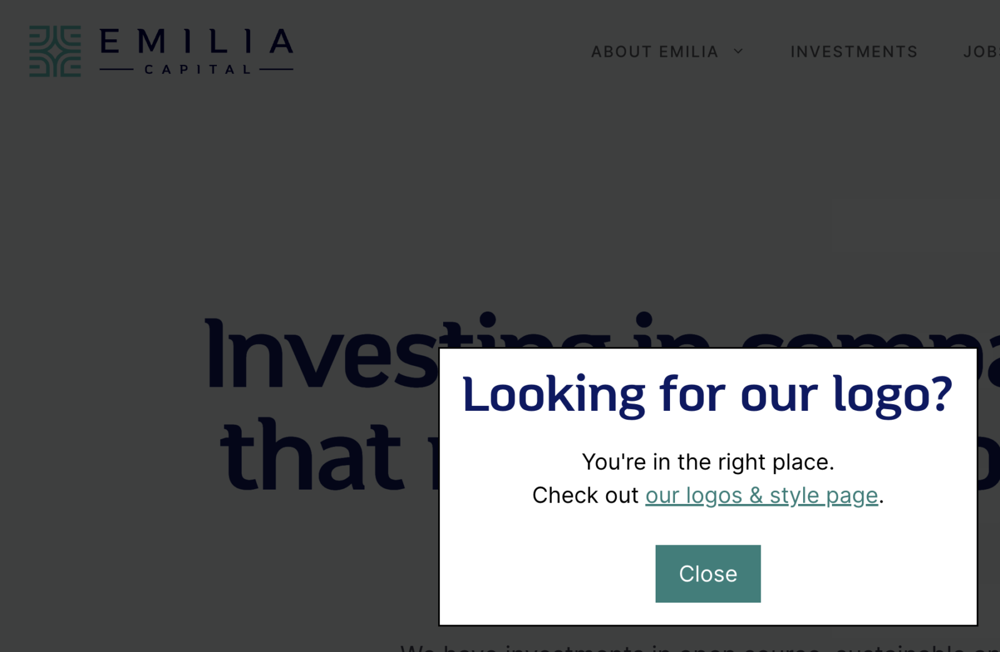

I always like it when I right-click a logo on a website because I need to get the logo, and the site’s designer has thought about this. If you right-click on the logo on our [Emilia Capital site](https://emilia.capital/), you’ll get a popup that sends you to our logo page. As of today, that’s not a popup, but technically a popover, using the new popover API in HTML.

An example of what we’re going to build in this post.## Step 1: the HTML

The HTML for this is extremely simple, and the magic is in line 1:

```xml
<div popover="manual" id="logo_popover">
	<h3>Looking for our logo?</h3>
	<p>You're in the right place.<br/>Check out <a href="/logo/">our logos & style page</a>.</p>
	<button popovertarget="logo_popover" popovertargetaction="hide">Close</button>
</div>
```

This is a popover; if you haven’t heard about it yet, popover is the new, browser-native way of doing modals, which *hugely* simplifies building modals. Just how much it simplifies it? Well, if I wanted to open the above popover on click, all I’d need to do is add this somewhere:

```xml
<button popovertarget="logo_popover" popovertargetaction="show">
  Open popover
</button>
```

In this case, we’re not going to open it with a button in the HTML, but rather on *right-*clicking the logo, so we need the tiniest bit of JavaScript.

## Step 2: the JavaScript

With JavaScript, we’re going to catch the `contextmenu` event of the logo. This means we’re going to grab right clicks on that element. The JavaScript is actually super simple, too. We find the logo with `document.querySelector`. We attach an event listener to the `contextmenu` event of that logo. Then, we prevent the default (which is showing the context menu). Lastly, we find the above popover by its `id` attribute and make it show up.

```xml
<script>
document.querySelector(".is-logo-image").addEventListener('contextmenu', function(event) {
	event.preventDefault();
	document.querySelector("#logo_popover").showPopover();
	}, false);
</script>
```

If you do not set the popover above to close manually, so instead of `popover="manual`, you just put `popover`, you may find that the `popover` closes immediately.

## Step 3: the CSS

There’s a *tiny* bit of styling needed to determine the color of the backdrop for your popover. Simply do this for a black backdrop, using the `::backdrop` pseudo-element:

```css
#logo_popover::backdrop {
  background: rgb(0 0 0 / 75%);
}
```

## Step 4: doing this in WordPress

If you want to do this in WordPress, you can add it with a simple bit of code, for instance, like this, to your `wp_footer`.

```php
/**
 * Output a popover for the logo.
 *
 * @link /popover-contextmenu/
 */
function joost_logo_popover_footer() {
?>
	<div popover="manual" id="logo_popover">
		<h3>Looking for our logo?</h3>
		<p>You are in the right place.<br/>Check out <a href="/logo/">our logos & style page</a>.</p>
		<button popovertarget="logo_popover" popovertargetaction="hide">Close</button>
	</div>

	<script>
	document.querySelector(".is-logo-image").addEventListener('contextmenu', function(event) {
		event.preventDefault();
		document.querySelector("#logo_popover").showPopover();
	}, false);
	</script>
<?php
}

add_action( 'wp_footer', 'joost_logo_popover_footer' );
```
