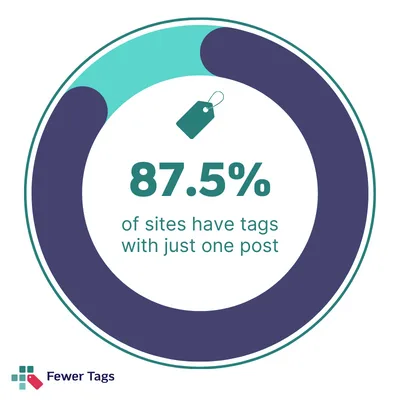
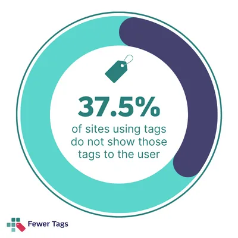
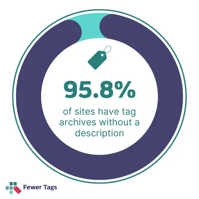

*This post was migrated to this site in January 2025 when we took down the Fewer Tags project site.*

Tags are not used correctly in WordPress. Approximately two-thirds of WordPress websites using tags are using (way) too many tags. This has significant consequences for a site’s chances in the search engines – especially if the site is large. WordPress websites use too many tags, often forget to display them on their site, and the tag pages do not contain any unique content. In this post, I’ll discuss these three main tag problems I’ve diagnosed WordPress websites with and propose solutions.

## About the research

As an [SEO consultant](/about-me/), I have repeatedly seen the problems that tags and tag pages can create. To better understand the extent of the problem, I’ve conducted a small research project. I’ve investigated 30 sites and analyzed the way these sites dealt with tags and tagpages. My analysis included 10 popular WordPress-based mom blogs, 10 WordPress news blogs (based on WordPress and writing about WordPress), and 10 randomly chosen WordPress-based publications from the [WordPress showcase](https://wordpress.org/showcase/).

The results shocked me. Mostly because I was expecting quite a few people to do it wrong; I wasn’t prepared for *how* wrong it would be. One site had 3-4,000 posts and 30,000 tags. Another had 1,000+ tag pages that *all* didn’t work. 87.5% of the sites that used tags had one or multiple tags with just one post in them.

For each of these sites, I checked the following:

- If they used tags.
- If they linked these tags from their posts.
- If they had a sensible number of tags compared to the size of their content library.
- If they had tag pages with just one post in them.
- If their tag pages actually *worked*.
- If their tag pages had a description/intro copy.

## First problem: way too many tags

People often add tags to their posts because WordPress suggests they do so. Perhaps people also add tags because they’re used to adding tags on other platforms, such as Instagram ([you shouldn’t do that](https://fewertags.com/dont-use-wordpress-tags-as-instagram/)). Sometimes (in about 10% of the websites in our research), websites even end up with more tags than posts. And that does not make *any* sense. Tags are supposed to structure your content. A good use of tags means that the number of tags on a website is significantly smaller than the number of posts. In our research, we’ve treated sites with 5 posts per tag on average as having a good use of tags. In Figure 1, you can see that the majority of the sites that we analyzed do not smartly use tags.

Figure 1: The (over-)use of tags on sites.People are often unaware that WordPress creates a specific new URL (a tag archive page) for each new tag you add to a page. WordPress lists all the articles with that specific tag on that tag page. But we see a lot of cases in which writers add a tag only once or twice. Of the sites we’ve analyzed, 87,5 % have tags containing only one post. Such a tag page will only list that one post. This page is very empty, and that’s bad for your chances of ranking in the search engines. It’s also a horrible user experience: you click from the article to the tag archive, because you want to read more content like that, and you’re presented with one choice: the article you just read. That’s a disappointment.

Figure 2: Percentage of sites with tags with just one post.## Second problem: Tags are not displayed

The second problem with tags is that the tags aren’t even displayed on websites. I’ve encountered this problem in about one-third of the sites I analyzed. People add tags to a post before publishing, but their website’s theme (design) doesn’t show these tags. In many themes or designs, there is just no place for the tags.

Figure 3: Percentage of sites using tags that don’t show those tags to the user.Having tags and not displaying them means you’re users are not using those tags at all. You’ll create a bunch of empty tag pages that nobody can visit. But since the tag pages *are* created and listed in your site’s XML sitemap, search engines *will* visit them, index them, etc. This takes resources away from your site pages that you want them to visit and index.

## Third problem: Tag pages do not have descriptions

The third problem with tags has to do with thin tag pages. Each new tag that people add to a post on their site will create a new tag page. This tag page could be where visitors to your website will find more information about a certain topic. It should at least have a description or an introduction. However, my research shows that only one WordPress site has done some optimization for its tag pages.

If you create a tag page, it would make sense to spend some time optimizing it. A tag page could be much more than just a list of links pointing toward articles with a tag. Ideally, A tag page should be a kind of homepage for a specific topic. It should help your visitors figure out and navigate to the content they want. However, the standard WordPress backend only allows for simple text editing on the tag pages. It provides an HTML field, which requires you to write code even if you want to add a simple thing like an internal link. This could be a reason why tag pages on most WordPress sites are so very thin.

Figure 4: Percentage of sites that don’t have a description on their tag archives.## How do we solve these problems?

We should use fewer tags, we should always display the tags we are using, and we should draft engaging introductions to our tag pages. That’s the solution. But that can be a lot of work.

Only recently have I developed a quick solution with the Fewer Tags plugin. The Fewer Tags plugin (free) will help you automatically remove all tag pages with fewer than 10 posts. You can also alter that number to something else. It’s a straightforward and quick way to handle the problem immediately. However, installing the Fewer Tags plugin does not offer a sustainable solution for dealing with tags.

Fewer Tags Pro, the premium version of the plugin I’ve built, will help you to work towards a more sustainable solution. The Pro plugin helps you to merge and redirect tags. Next to that, buying Fewer Tags Pro gives users access to an online course, explaining in-depth everything people need to know and understand about tags. We’ll help you display tags on your site and draft engaging introductions to those tag archive pages. The premise of Fewer Tags Pro is that we help you solve all the problems with tags and use tags to your advantage.

Several sites (6 of the 30) in our analysis do not use tags. Within the category of WordPress websites, this percentage was especially high. We suspect these sites are aware of the problem with tags and decided to use only categories as a taxonomy. That makes sense and would also be a solution to the tag problem.

## How did I do my research?

Conveniently, because all these sites run WordPress, they have pretty recognizable patterns. If they used an SEO plugin, I checked their XML sitemaps. If they didn’t, or I couldn’t find tags in those, I used the REST API to get the number of posts and tags on their site using these scripts. If that didn’t work, I ran a crawl, which I luckily only had to do on one site. After that, I randomly opened some articles on each site to see if those had tags displayed in them.

When I found tag pages, I clicked on them and checked what they looked like, and I also clicked on articles on that tag page to see if they linked back to the tag page I just came from.

To determine whether a site had too many tags, I looked at their XML sitemaps again or the REST API using the scripts linked before. Mostly because those are the easiest to check. I then divided their number of posts by their number of tags to determine a posts-to-tags ratio.

## Why these checks?

Now, let me explain why I checked these particular things one by one:

### Why check if they use tags?

Mostly because I wanted to see how many sites use tags and didn’t want to exclude sites that didn’t use tags. There’s nothing wrong with *not* using tags.

### What’s bad about not linking to tags?

If you’re not linking your posts to your tags, then what are you using them for? If you’re just using them for internal reasons, the best thing you can do is *not show them to visitors anywhere.* If they’d done that, I wouldn’t have been able to find their tag pages.

### When does a site have too many tags?

Tags should bring content together. They should allow you to go from one piece of content to another and meaningfully connect pages. If you have too many tags, this doesn’t help the user’s navigation, and you actually also add tons of URLs on your site that search engines have to index, so that’s not helpful.

I determined a site had too many tags when the ratio of the number of posts divided by the number of tags was bigger than or equal to 5. So if you have 200 tags and 1,000 posts, I’d still deem that “acceptable”, even though I personally think that’s a bit much already.

### What’s bad about one post in a tag?

You might be thinking: what’s bad about having one post in a tag? Well, let me explain. You get to a post. You liked that post so much that at the end of the post, you click on a tag underneath it, because you want to read more of that type of content. You are what we call an engaged reader. Then, the site presents you with a tag page that has just one post in it. The post you’ve just read. That’s a disappointment, right? That’s what we’d like to prevent.

### What do you mean “if their tag pages work?”

On a few of the sites, the tag pages didn’t work. They were either empty (not listing the articles with the tag) or had big missing items, like missing a main heading on the page, or had clear errors. Tag pages are not pages people look at every day. That became clear.

### Why does a tag need a description?

If someone clicks on a tag, they want to read more about a certain topic. With a description, you could help them. We explain how you could do this in [our course about tags](https://fewertags.com/too-many-tags-2-possible-solutions/).
