At the end of April, beginning of May, 2019, Marieke and I visited Peru with our kids. The main reason for going to Peru was to attend the wedding of two of our friends Jessie & Jorge. These friends also happen to own a [travel agency that specializes in travel to Peru](https://www.machupicchutravel.nl/), and helped us out a *lot* during this trip which was nice.

I wanted to share some highlights from this trip as I feel it’s a waste not to share these photos with more people.

## Cuzco

The first city we visited in Peru was Cuzco, which, with its 3400 meters above sea level, was literally a breathtaking experience. The city is lovely, lots of tourists but the locals are very friendly and there are some very nice sights to see in and around Cuzco.

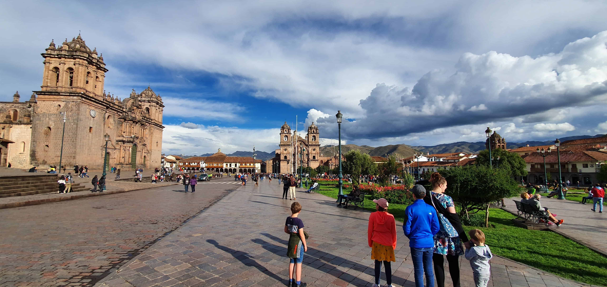Cuzco’s main square, the Plaza de ArmasDuring a tour around some sights in the surroundings of Cuzco, I snapped a few pics of the surroundings:

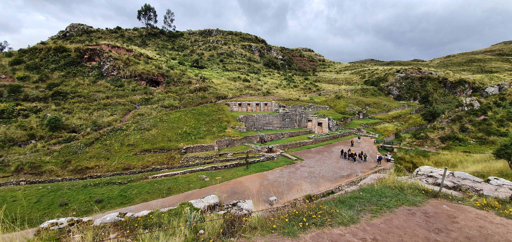Tambomachay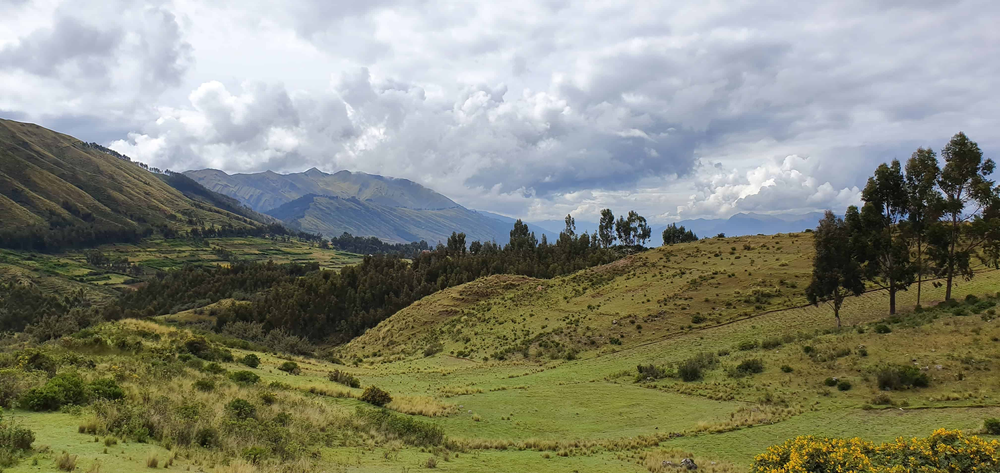View from Puka Pukara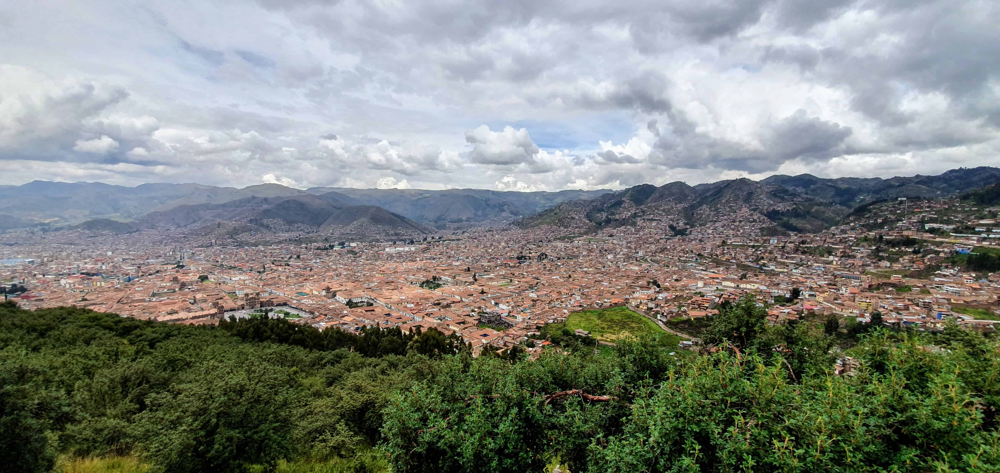Cuzco seen from Sacsayhuaman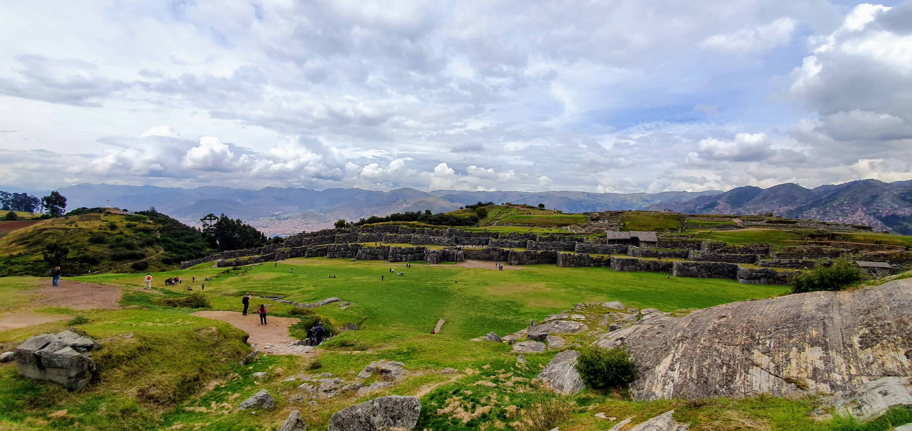SacsayhuamanAfter a few days in Cuzco we did what’s called a two day Inca trail towards Machu Picchu. In reality, this means you walk the Inca trails for one day and then have the next day to visit and admire Machu Picchu. This one day hike was about 12 kilometers and, according to my watch, about 240 full stairs. You go through some old Incan towns like Wiñay Wayna, which was incredibly beautiful.

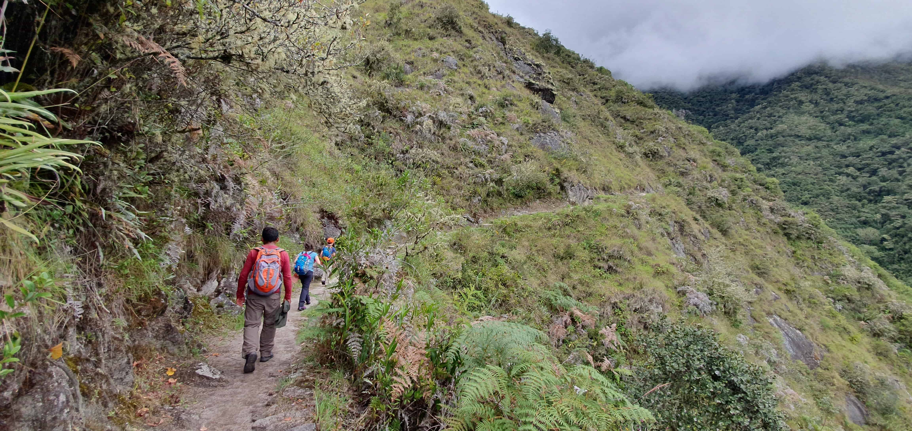Walking the Inca trail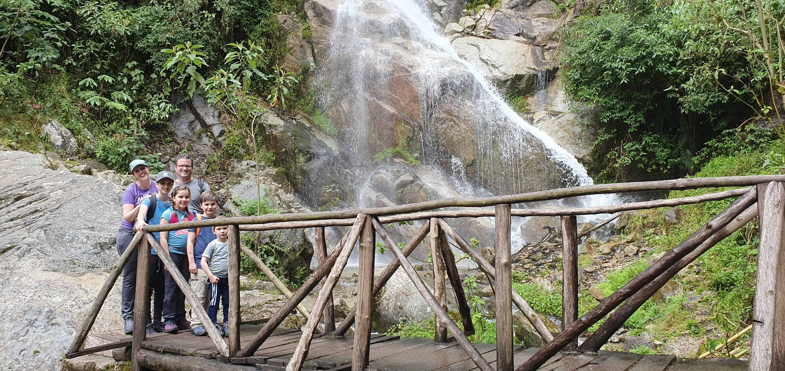Beautiful, beautiful trails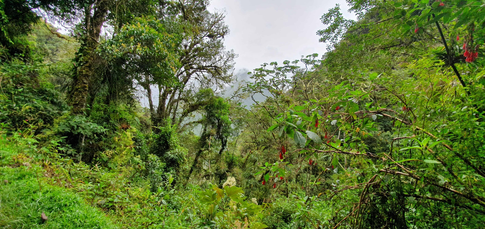Beautiful nature during the trails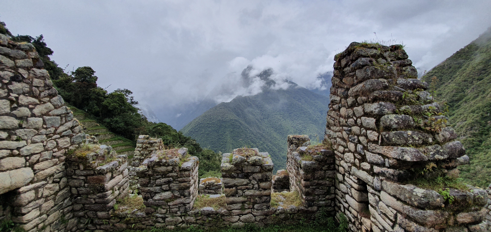Wiñay Wayna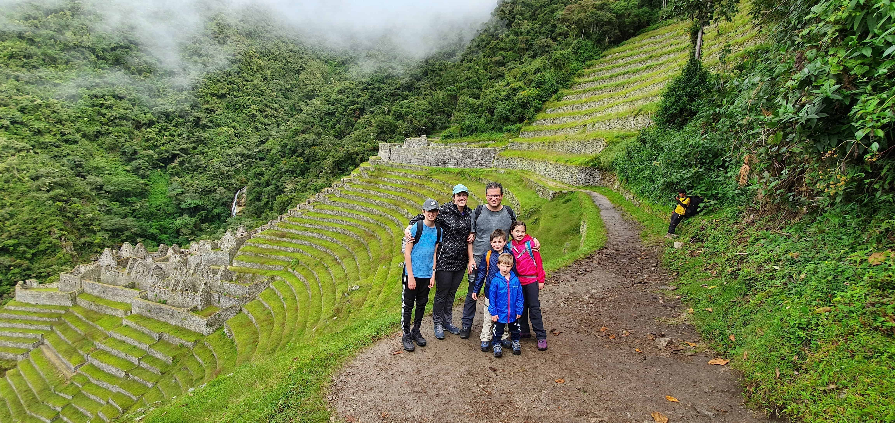Wiñay WaynaAfter that day of walking (it was heavy but doable) you end up on one of the most beautiful places I’ve ever visited in my life: Machu Picchu. Machu Picchu is of course arguably the most important touristic attraction of Peru.

## Machu Picchu

This site is absolutely incredible. I don’t think you can truly capture in images what this place looks like, but I’ve tried to collect a few good ones:

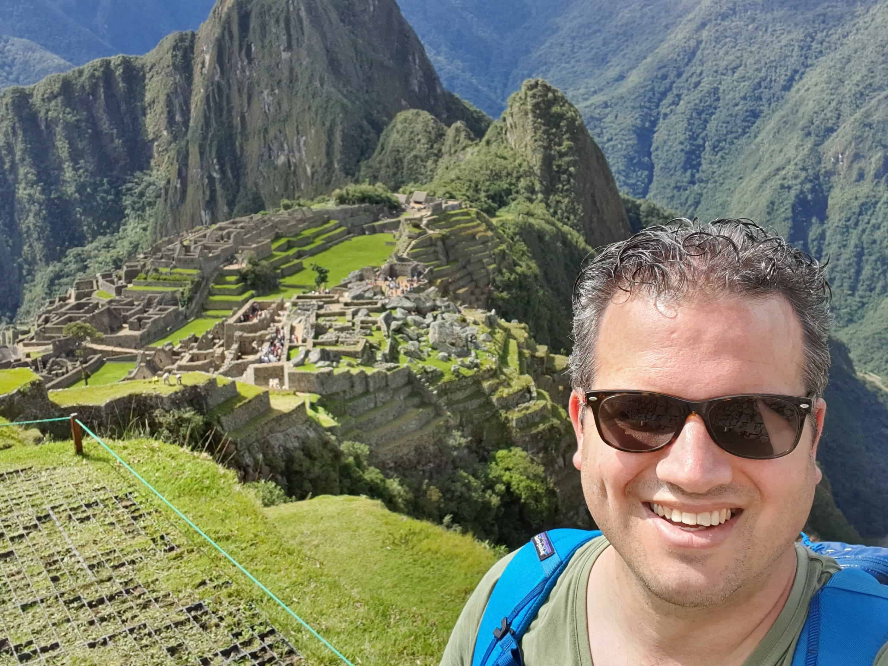Obligatory selfie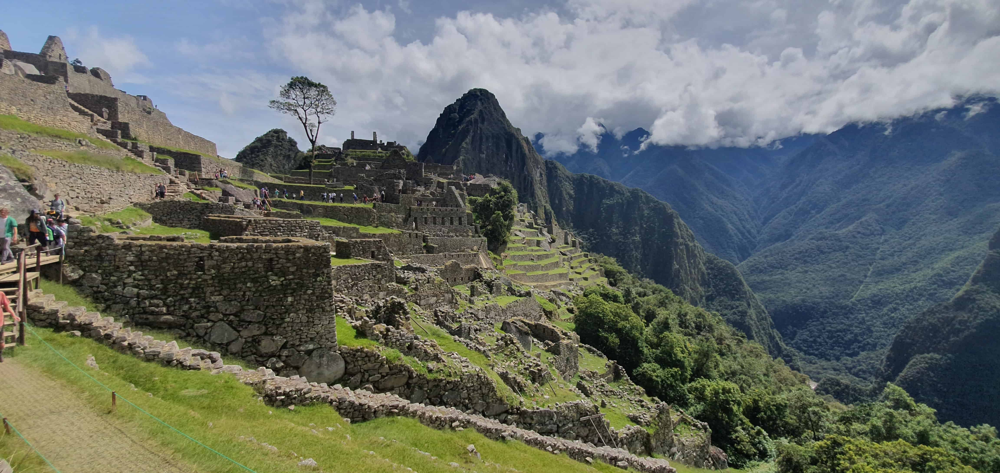Macchu Pichu from the side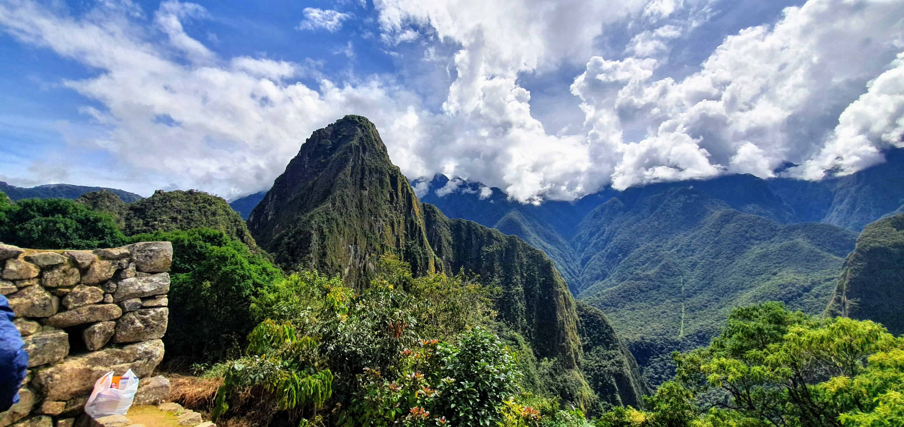View from Macchu Pichu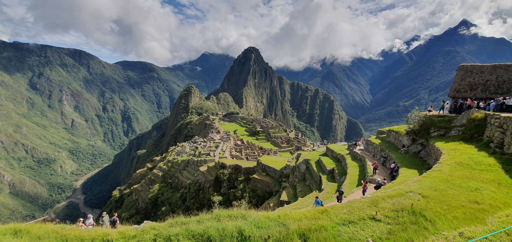Macchu Pichu with Huayna Pichu in the backWhile it’s hard to top Macchu Pichu, we did see a few more things in Peru. We toured around the [Sacred Valley](https://en.wikipedia.org/wiki/Sacred_Valley) for a day and saw some other truly marvelous sites:

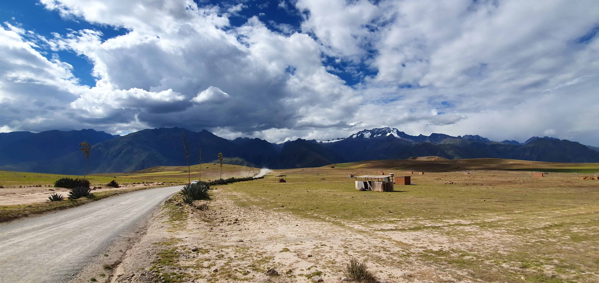I got out of the car during our trip to make this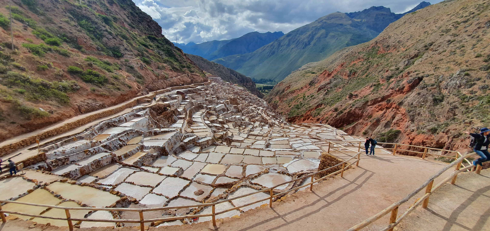Mara Salt Mines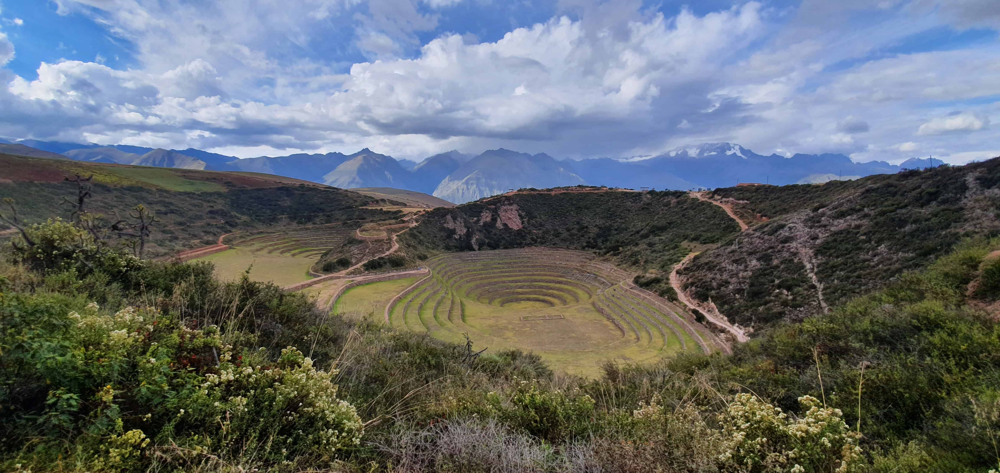Moray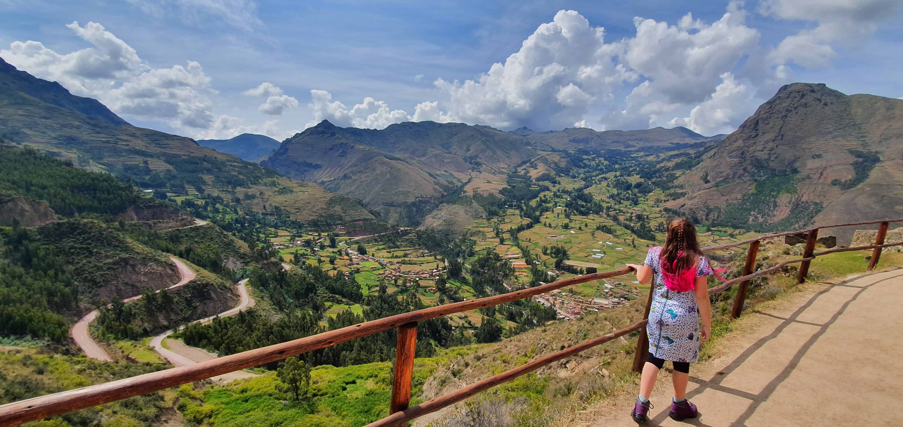View from Pisac (and my lovely daughter)In all, Peru was absolutely fantastic. The wedding we attended was very lovely and in an absolutely fantastic spot as well, making a very nice end to our trip.
