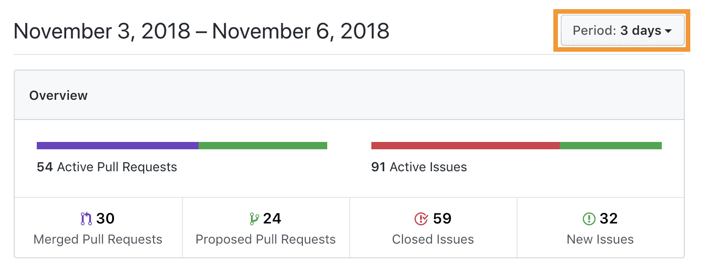
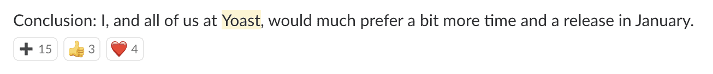

For the last few months, the WordPress developer community has been moving towards a release of WordPress 5.0. This is the highly anticipated release that will contain the new Gutenberg editing experience. It’s arguably one of the biggest leaps forward in WordPress’ editing experience *and* its developer experience in this decade. It’s also not done yet, and if we keep striving for its planned November 19th release date, we are setting ourselves up for failure.

**Update November 9th: WordPress 5.0 has been moved**  
The new release date is November 27th, 2018. See the [Make/Core post](https://make.wordpress.org/core/2018/11/09/update-on-5-0-release-schedule/) for details. While I’m happy that it’s been postponed, I’m not sure whether this is enough to get WordPress 5.0 to be as accessible and stable as I think it should be. Time will tell, I guess.

Let me begin by stating that I love Gutenberg. It’s the best thing since sliced bread as far as content editing is concerned. I’m writing this post in Gutenberg. I started writing it on my iPhone. It rocks. But it also still has numerous bugs. In fact, the editor broke on me during writing this post and failed to autosave all the contents. Luckily I saw it breaking and copied the paragraphs to an external editor.

## Reasons for delaying

There are a two main reasons why the November 19th timeline is in my opinion untenable:

- There are some [severe accessibility concerns](https://make.wordpress.org/accessibility/2018/10/29/report-on-the-accessibility-status-of-gutenberg/). While these aren’t new and a few people are working hard on them, I actually think we can get a better handle on fixing them if we push the release back. Right now it looks to me as though keyboard accessibility has *regressed* in the last few releases of Gutenberg.
- The most important reason: the overall stability of the project isn’t where it needs to be yet. There are so many open issues for the 5.0 milestone that even fixing all the blockers before we’d get to Release Candidate stage next week is going to prove impossible. We have, at time of writing [212 untriaged bugs](https://github.com/wordpress/gutenberg/issues?utf8=%E2%9C%93&q=is%3Aissue+is%3Aopen+no%3Amilestone+label%3A%22%5BType%5D+Bug%22+-label%3A%22future%22+) and [165 issues on the WordPress 5.0 milestone](https://github.com/wordpress/gutenberg/issues?q=is%3Aopen+is%3Aissue+milestone%3A%22WordPress+5.0%22).

## People are working *hard*

The amount of work being done every day right now by the development team is bordering on the insane. Look at the work for the last three days:

I’d normally be happy with this for a week. This is 3 days, also including a Sunday. It’s been like this for a while. I appreciate all these people doing the hard work, but moving this fast only increases the chance of regressions.

When [I mentioned earlier today](https://wordpress.slack.com/archives/C02QB2JS7/p1541503290677300) in the WordPress Slack’s #core-editor channel that I think we should push back, the response was pretty positive:

Let’s get this straight: *this is in the channel with a large part of the people working on this release*. I’m not the first to say this. I hope this post will help the powers that be come to the same conclusion.

## Conclusion: push back, and zoom out

All these things considering, my conclusion is simple: we need to push back the release. My preference would be to January. This would allow us to zoom out a bit, prevent regressions and overall, lead to a better product, with finished documentation. Something that’s worthy of the label RC when we decide to stick that on it. Right now, I feel that the beta is more of an alpha, and we’ll end up with an RC that’s more of a beta.

> “Poetry is not an expression of the party line. It’s that time of night, lying in bed, thinking what you really think, making the private world public, that’s what the poet does.”
> 
> **Allen Ginsberg, from [Ginsberg, a biography](http://books.google.com/books?id=E4gXAQAAMAAJ&focus=searchwithinvolume&q=%E2%80%9CPoetry+is+not+an+expression+of+the+party+line.+It%27s+that+time+of+night%2C+lying+in+bed%2C+thinking+what+you+really+think%2C+making+the+private+world+public%2C+that%27s+what+the+poet+does.)**
