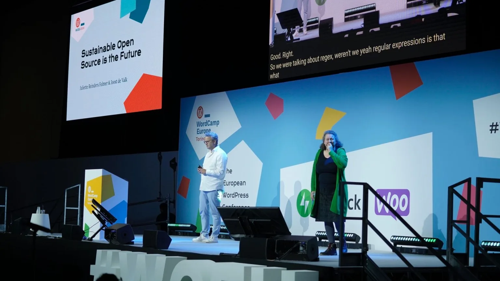
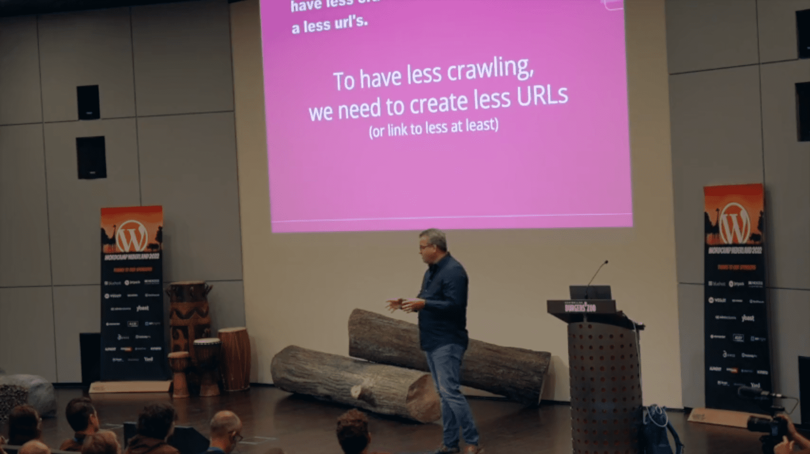
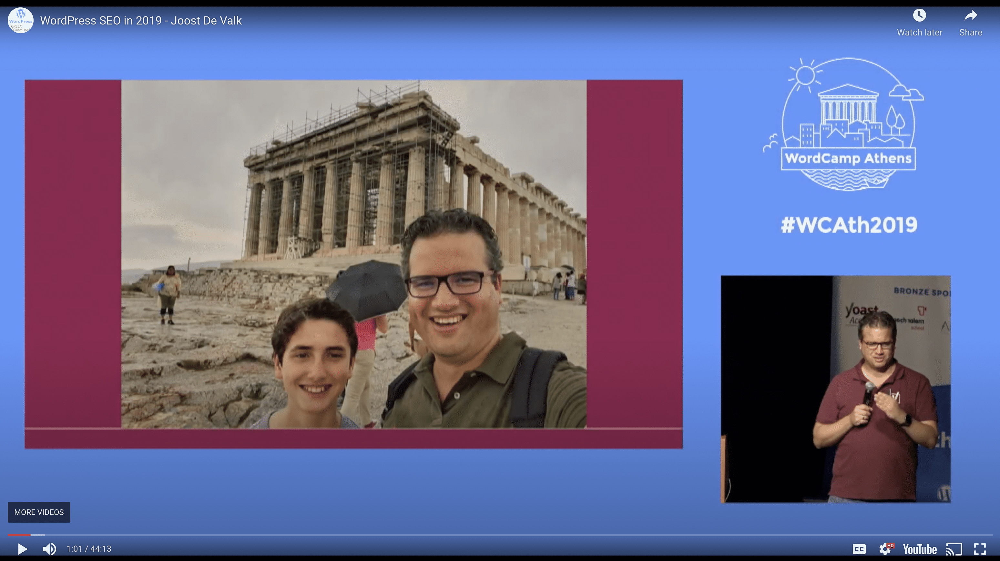
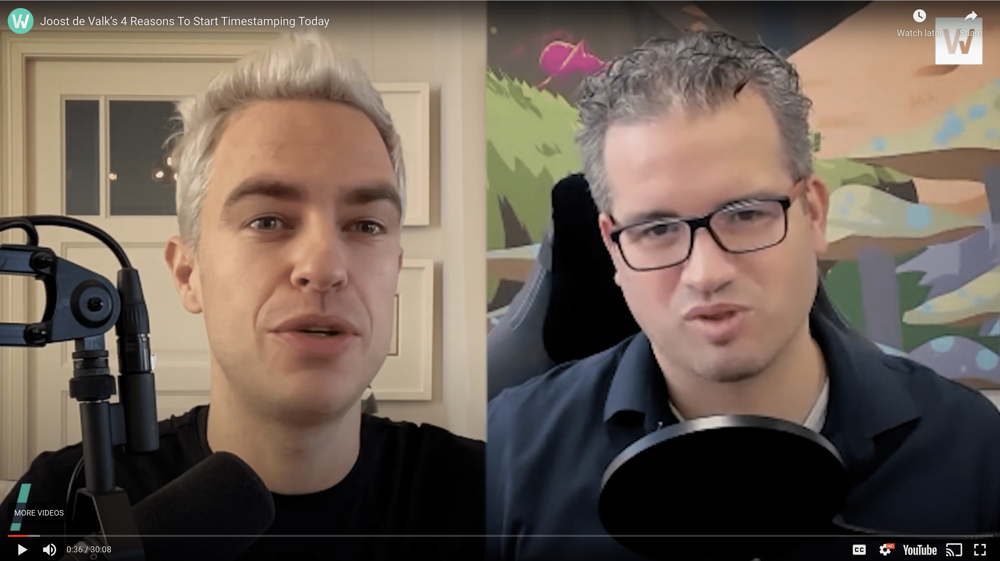
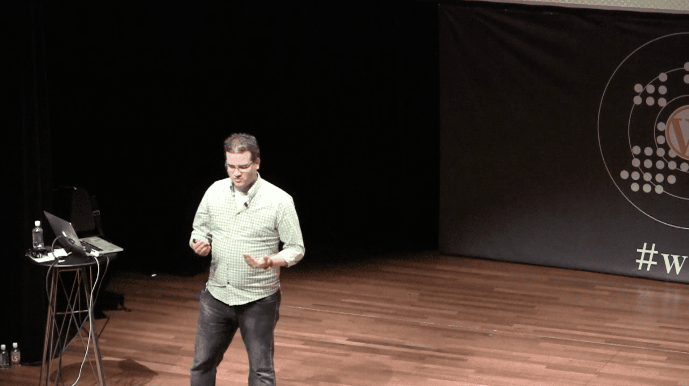
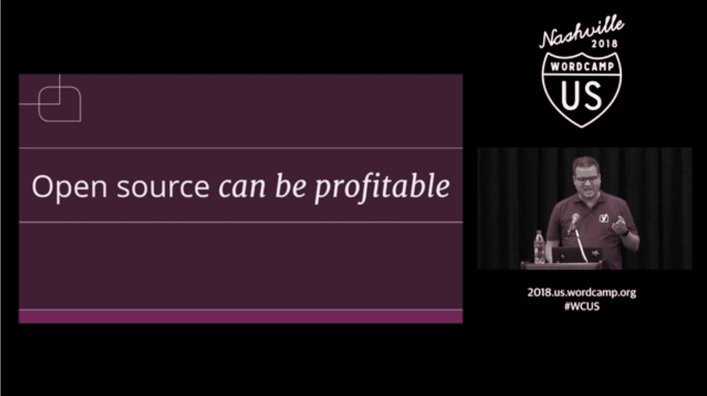

## Hi! I’m Joost de Valk, an internet entrepreneur from the Netherlands.

I’m married to [Marieke](https://marieke.blog/); we have four children and live in Wijchen, the Netherlands.

I have a long history in digital marketing and WordPress. I am the founder of Yoast, best known for its Yoast SEO plugin for WordPress.

I have worn a couple of different hats in my time at Yoast. First, for almost 9 years, I was the CEO, then I became Chief Product Officer when my wife [Marieke](https://marieke.com/) took over as CEO. We sold Yoast to Newfold Digital in August of 2021, after which I became Head of WordPress Strategy at Newfold for a while. I then came back for a 6-month stint as interim CTO (because they were suddenly without one) in 2022-2023. I finally left the company in April 2023.

- [Gravatar](https://gravatar.com/joostdevalk)
- [GitHub](https://github.com/jdevalk)
- [LinkedIn](https://www.linkedin.com/in/jdevalk/)
- [Bluesky](https://bsky.app/profile/joost.blog)
- [Threads](https://www.threads.net/@joostdevalk)
- [WordPress](https://profiles.wordpress.org/joostdevalk)
- [Instagram](https://www.instagram.com/joostdevalk)
- [Mastodon](https://joost.net/@joost)

When we left Yoast, Marieke and I started investing through our company, [Emilia Capital](https://www.altha.nl/). We invest in companies that play at least partly in the digital space (and often in WordPress). Because of that, I’m on the board of companies like [PatchStack](https://patchstack.com/) and [Atarim](https://atarim.io/). We also started our own new company; we’re working hard on [Progress Planner](https://progressplanner.com/).

I founded Yoast in 2010 after working as a digital marketing consultant in several different companies. I’ve worked on some of the biggest SEO projects in the world, like the [Guardian’s site migration](https://www.theguardian.com/info/developer-blog/2014/feb/18/how-the-guardian-successfully-moved-domain)[ from .co.uk to theguardian.com](https://www.theguardian.com/info/developer-blog/2014/feb/18/how-the-guardian-successfully-moved-domain).

In my spare time, I can often be found coaching kids’ soccer at [AWC](https://svawc.nl/), where I’m also a board member. On holidays, Marieke and I love spending time in our [holiday home in Tuscany](https://limonaia.house/) or traveling to other places in the world.

### Work with me?

I reserve a portion of my time for digital / growth consultancy with companies we don’t have an investment in. I can advise you and your company on your (digital) product direction, your search/SEO strategy, and how you can leverage the open web for your company.

Would you be interested in that? Please fill out my [contact form](/contact-me/).

### Past speaking engagements

  <a href="/videos/sustainable-open-source-is-the-future/" class="group">
    
    
Sustainable open source is the future

  </a>
  <a href="/videos/improve-the-environment-start-with-your-website/" class="group">
    
    
Improve the environment. Start with your website!

  </a>
  <a href="/videos/wordpress-seo-in-2019/" class="group">
    
    
WordPress SEO in 2019

  </a>
  <a href="/videos/why-timestamping-will-be-good-for-seo/" class="group">
    
    
Why timestamping will be good for SEO

  </a>
  <a href="/videos/the-victory-of-the-commons/" class="group">
    
    
The victory of the commons

  </a>
  <a href="/videos/the-business-of-open-source/" class="group">
    
    
The business of open source

  </a>

