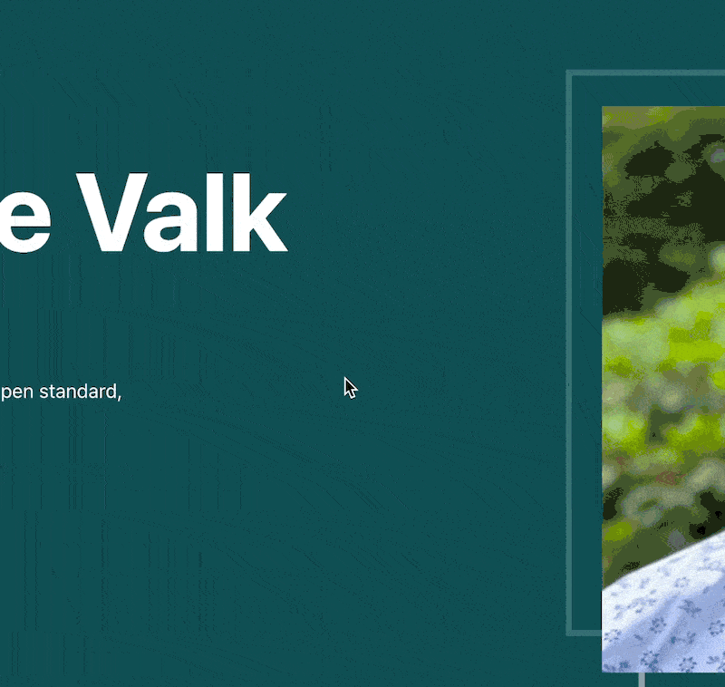
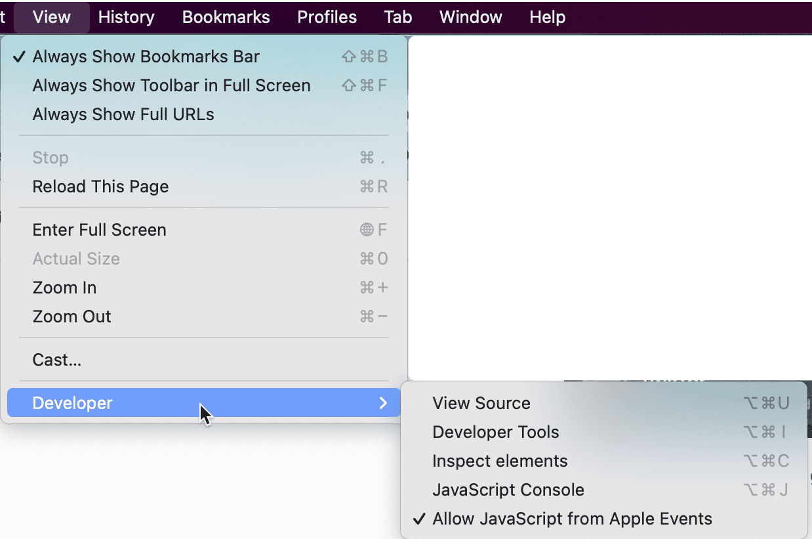

Quix is an AlfredApp workflow that makes quick analyses of websites for SEO, page speed and other things a lot easier. It prevents you from copy and pasting URLs into different tools a lot, instead opening them up with a few keystrokes.

## Table of contents

- [Demo](#h-demo)
- [Requirements](#h-requirements)
- [Frequently asked questions](#frequently-asked-questions)
- [Download](#h-download)
- [Changelog](#h-changelog)
    - [3.0](#3-0)
    - [2.1](#2-1)
    - [2.0.1](#2-0-1)
    - [2.0](#2-0)
    - [1.0](#toc_4)

## Demo

After you install this your workflow, the following magic happens when you hit Alt-Q ( `⎇-Q` ) or type `quix` in Alfred:

A gif of Quix in actionOnce you select one of the actions, it’ll take the foremost URL of your browser and perform it. This way I can literally run a speed test, a schema test and some social snippet tests in a few seconds, without copying and pasting URLs all the time or using 5 different bookmarklets.

## Requirements

For this to work you need a Mac, with [AlfredApp](https://www.alfredapp.com/) (version 5), and since it is a workflow, you’ll need their paid [Powerpack](https://www.alfredapp.com/powerpack/) too. Don’t worry it *really* is worth it on its own, even without this new added Quix goodness.

Quix currently works with Safari, Safari Technology Preview, Chrome, Chrome Canary, Firefox (including its development edition) Brave Browser (including its beta) and Vivaldi.

## Frequently asked questions

**The Twitter command or SEOCSS command isn’t working, what’s wrong?**You have to enable “JavaScript from Apple Events” for this to work. In most browsers this is under View -> Developer -> Allow JavaScript from Apple events  
  

 

**How do I get updates for Quix?**The workflow will auto-update to the latest version!

 

**Do you support Firefox?**As of version 3.0: yes we do!

 

**Could you support <insert browser here>?**If your browser doesn’t already work and you’d like to have support for it, please [open an issue on GitHub](https://github.com/jdevalk/alfred-quix/issues)!

 

 

## Download

You only have to download Quix once, after that it should auto-update from [Quix’s Github](https://github.com/jdevalk/alfred-quix) automatically.

[Download Quix AlfredApp workflow](https://github.com/jdevalk/alfred-quix/raw/main/Quix.alfredworkflow)

## Changelog

### 3.0

- **Major browser support improvements**: added support for Firefox, Firefox developer edition, Chrome Canary Safari Technology Preview, Brave Beta and Vivaldi.
- Added a user config option to select a default browser, for cases when you open Quix from outside a browser.
- Added an “is this site down for everyone” command.
- Added a “who hosts this site” command.
- Re-built much of the workflow to work a bit more intuitive.

### 2.1

- Added support for Brave Browser.

### 2.0.1

- Some fixes as AlfredApp updated how the automation tasks work slightly.

### 2.0

- Made Alfred Quix compatible with AlfredApp V5 workflow builder.
- Added [OneUpdater](https://www.alfredforum.com/topic/9224-oneupdater-%E2%80%94-update-workflows-with-a-single-node/) so the Workflow can be updated easily.

### 1.0

- Initial version.
