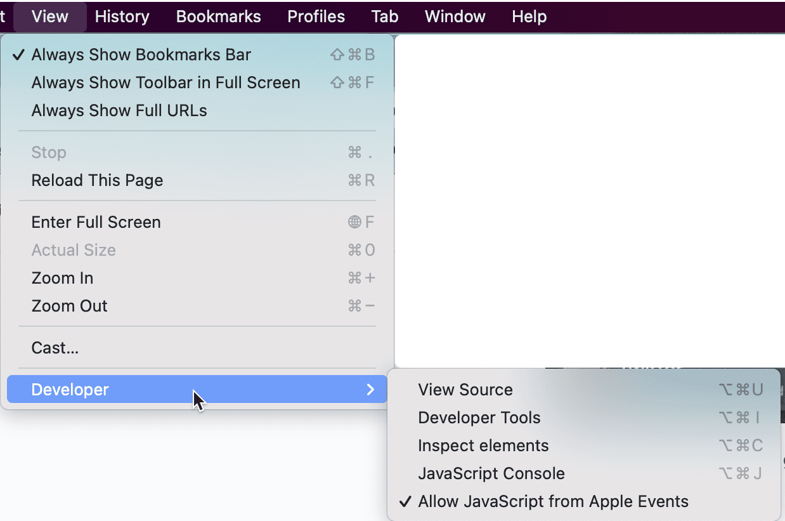

Quix is an AlfredApp workflow that makes quick analysis of websites for SEO, page speed, security, and other checks a lot easier. It prevents you from copy-pasting URLs into different tools, instead opening them with a few keystrokes.

## Demo

After you install this workflow, the following magic happens when you hit Alt-Q ( `⎇-Q` ) or type `quix` in Alfred:

Once you select one of the actions, it'll take the foremost URL of your browser and perform it. This way you can run a speed test, a schema test, and some social snippet tests in a few seconds, without copying and pasting URLs all the time or using 5 different bookmarklets.

## Requirements

For this to work you need a Mac, with [AlfredApp](https://www.alfredapp.com/) (version 5), and since it is a workflow, you'll need their paid [Powerpack](https://www.alfredapp.com/powerpack/) too.

Quix currently works with Safari, Safari Technology Preview, Chrome, Chrome Canary, Firefox (including its development edition), Brave Browser (including its beta), and Vivaldi.

## Frequently asked questions

**The Twitter command or SEOCSS command isn't working, what's wrong?**

You have to enable "JavaScript from Apple Events" for this to work. In most browsers this is under View → Developer → Allow JavaScript from Apple events.

**How do I get updates for Quix?**

The workflow will auto-update to the latest version!

**Do you support Firefox?**

As of version 3.0: yes we do!

**Could you support &lt;insert browser here&gt;?**

If your browser doesn't already work and you'd like to have support for it, please [open an issue on GitHub](https://github.com/jdevalk/alfred-quix/issues)!

## Download

You only have to download Quix once, after that it should auto-update from [Quix's GitHub](https://github.com/jdevalk/alfred-quix) automatically.

[Download Quix AlfredApp workflow](https://github.com/jdevalk/alfred-quix/releases/latest/download/Quix.alfredworkflow)

## Changelog

### 4.1

- Added an "Is it agent ready?" command that opens [isitagentready.com](https://isitagentready.com) for the current browser URL.

### 4.0.1

- Switched auto-updater to use GitHub releases.

### 4.0

- Added speed checks via GTmetrix and WebPageTest.
- Added W3C HTML validator, SSL certificate check (SSL Labs), and DNS check (MXToolbox).
- Added Robots.txt, security headers, and Bing cache commands.
- Added unified social preview via metatags.io; renamed old "Social" command to "Clear social cache".
- Updated Twitter card validator to cards-dev.x.com.
- Removed broken Google cache command; replaced with Bing cache.
- Removed deprecated Mobile Friendly Test.
- Updated PageSpeed Insights URL to pagespeed.web.dev.

### 3.1.2

- Fix for site search commands when your search term is more than one word.

### 3.1.1

- Minor fix for archive.org site command.

### 3.1

- Added support for Archive.org with two new commands (page and whole-site lookups), plus a command to save the current page to Archive.org.

### 3.0

- **Major browser support improvements**: added support for Firefox, Firefox Developer Edition, Chrome Canary, Safari Technology Preview, Brave Beta, and Vivaldi.
- Added a user config option to select a default browser, for cases when you open Quix from outside a browser.
- Added an "is this site down for everyone" command.
- Added a "who hosts this site" command.
- Re-built much of the workflow to work more intuitively.

### 2.1

- Added support for Brave Browser.

### 2.0.1

- Some fixes as AlfredApp updated how the automation tasks work slightly.

### 2.0

- Made Alfred Quix compatible with AlfredApp V5 workflow builder.
- Added [OneUpdater](https://www.alfredforum.com/topic/9224-oneupdater-%E2%80%94-update-workflows-with-a-single-node/) so the workflow can be updated easily.

### 1.0

- Initial version.
