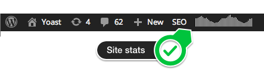

The Clicky for WordPress plugin makes it easy for you to add your [Clicky analytics](http://clicky.com/145844) tracking code to your WordPress install, while also giving you some advanced tracking options.

## Installation of the Clicky WordPress plugin

1. Search for `clicky` in the plugin install screen under Plugins -> Add New
2. Install & activate Clicky for WordPress
3. Click the link that appears or go to Settings -> Clicky and enter your Site ID, Site Key and Site Admin Key, you can find those on your [Clicky homepage](http://clicky.com/145844).
4. Save settings: you’re done.

## Clicky Analytics dashboard

The plugin adds a page under the Dashboard, called Clicky stats, that gives you a quick overview of the stats for your site. It also adds a small image to your WordPress toolbar showing you the visits to your site in the last 48 hours:

Clicky site stats in the WP admin bar## Advanced settings for the Clicky WordPress plugin

The Clicky plugin has a couple of advanced settings. They mostly speak for themselves; but let’s go over them:

- Ignore admin users makes Clicky ignore the admin user *when they’re logged in*.
- Disable cookies makes Clicky track without using any cookies. It still tracks personal data, but it doesn’t use cookies anymore.
- Track names of commenters allows you to see the names of people who commented on your site in your Clicky Analytics.
- The outbound link pattern option allows you to track certain kinds of links as *outbound* links, when they’re actually internal. This is useful when you redirect, for instance, your affiliate links through a /out/ or /go/ redirect script or plugin locally.

### Download

Download the plugin on WordPress.org:

[Download Clicky](https://wordpress.org/plugins/yoast-comment-hacks/)

### GitHub

Want to follow development, submit an issue or a patch? Come to the [Clicky GitHub repo](https://github.com/jdevalk/clicky/).

### Security issues

Please report security issues through our [Patchstack VDP](https://patchstack.com/database/vdp/yoast-comment-hacks).
